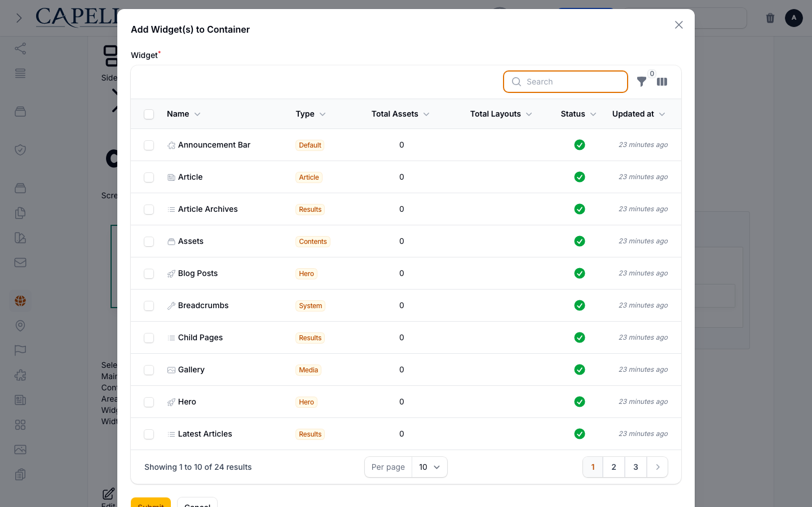

# Layout Builder

<!-- prettier-ignore-start -->

## What This Plugin Adds

Layout Builder is an **Available**, **Schema-owning** Capell package in the **Capell Foundation** product group. It ships as `capell-app/layout-builder` and extends these surfaces: admin, frontend, console.

Layout Builder adds a visual page composition workflow with layout areas, widgets, reusable widgets, presets, and reversible layout edits.

Editors can add, reorder, resize, and edit page widgets in admin. Visitors receive the saved layout graph as ordinary public output without authoring markers.

Evidence: [`src/LayoutBuilderServiceProvider.php`](src/LayoutBuilderServiceProvider.php), [`src/Actions/PersistLayoutBuilderStateAction.php`](src/Actions/PersistLayoutBuilderStateAction.php), [`src/Actions/SaveLayoutPresetAction.php`](src/Actions/SaveLayoutPresetAction.php), [`tests/Feature/Livewire/LayoutBuilderContentFirstTest.php`](tests/Feature/Livewire/LayoutBuilderContentFirstTest.php), [`src/Actions/BuildPublicLayoutGraphAction.php`](src/Actions/BuildPublicLayoutGraphAction.php), [`tests/Feature/Render/LayoutBuilderPublicRenderingSafetyTest.php`](tests/Feature/Render/LayoutBuilderPublicRenderingSafetyTest.php), [`tests/Feature/Livewire/LayoutPresetLivewireTest.php`](tests/Feature/Livewire/LayoutPresetLivewireTest.php).

Status details:

- Status: Available
- Tier: free
- Bundle: foundation
- Composer package: `capell-app/layout-builder`
- Namespace: `Capell\LayoutBuilder`
- Theme key: not applicable

## Why It Matters

**For developers:** Registries and typed Actions provide stable extension points for widget definitions, layout widgets, presets, and public render data.

**For teams:** Teams can compose pages and reuse approved sections without asking a developer to build a new template for each page.

Evidence: [`src/Support/LayoutWidgets/LayoutWidgetRegistry.php`](src/Support/LayoutWidgets/LayoutWidgetRegistry.php), [`src/Support/WidgetExtensions/WidgetExtensionRegistry.php`](src/Support/WidgetExtensions/WidgetExtensionRegistry.php), [`src/Actions/BuildPublicLayoutGraphAction.php`](src/Actions/BuildPublicLayoutGraphAction.php), [`tests/Integration/PublicLayoutGraphActionTest.php`](tests/Integration/PublicLayoutGraphActionTest.php), [`docs/overview.admin.md`](docs/overview.admin.md), [`src/Actions/CreateLinkedLayoutPresetAction.php`](src/Actions/CreateLinkedLayoutPresetAction.php), [`src/Actions/InsertLinkedLayoutPresetAction.php`](src/Actions/InsertLinkedLayoutPresetAction.php).

## Screens And Workflow

Screenshot contract: `docs/screenshots.json`.

- Layout Builder visual editor with main and sidebar containers (admin, optional).
- Layout Builder content-first editing mode (admin, optional).
- Layout Builder add widget action (admin, required).
- Layout Builder add container action (admin, required).
- Layout Builder edit widget action (admin, required).
- Layout Builder edit container action (admin, required).
- Layout Builder responsive preview (admin, optional).
- Layout Builder tree selection (admin, optional).
- Layout Builder preset action fixture (frontend, optional).
- Layout Builder undo and redo actions fixture (frontend, optional).
- Layout Builder bulk change criteria fixture (frontend, optional).
- Layout Builder bulk change review fixture (frontend, optional).
- Layout Builder main and sidebar admin example (admin, optional).
- Layout Builder main and sidebar public example (frontend, optional).
- Layout Builder full-width public example (frontend, optional).
- Widgets admin index (admin, required).
- Create and edit widget form with widget assets (admin, required).
- Sections admin index (admin, required).

## Technical Shape

- Service providers: `Capell\LayoutBuilder\LayoutBuilderServiceProvider`, `AbstractFoundationWidgetServiceProvider`.
- Config files: `packages/layout-builder/config/capell-layout-builder.php`.
- Migrations: `packages/layout-builder/database/migrations/2026_05_10_190841_01_create_layouts_table.php`, `packages/layout-builder/database/migrations/2026_05_10_190841_02_create_widgets_table.php`, `packages/layout-builder/database/migrations/2026_05_10_190841_03_create_widget_assets_table.php`, `packages/layout-builder/database/migrations/2026_05_10_190841_04_create_widget_widgets_table.php`, `packages/layout-builder/database/migrations/2026_05_10_190841_05_add_container_widgets_to_layouts_table.php`, `packages/layout-builder/database/migrations/2026_05_10_190841_06_create_layout_presets_table.php`, `packages/layout-builder/database/migrations/2026_06_07_000001_create_layout_bulk_change_tables.php`, `packages/layout-builder/database/migrations/2026_07_09_000001_create_public_widget_snapshots_table.php`, `packages/layout-builder/database/migrations/2026_07_10_000001_add_linked_preset_fields_to_layout_presets_table.php`, `packages/layout-builder/database/migrations/2026_07_10_000002_create_layout_preset_usages_table.php`, `packages/layout-builder/database/migrations/2026_07_10_000003_create_layout_preset_sync_runs_table.php`.
- Models: `Layout`, `LayoutBulkChangeResult`, `LayoutBulkChangeRun`, `LayoutPreset`, `LayoutPresetSyncResult`, `LayoutPresetSyncRun`, `LayoutPresetUsage`, `PublicWidgetSnapshot`, `Widget`, `WidgetAsset`, `WidgetWidget`.
- Filament classes: `CreateWidgetAction`, `ActionsRepeater`, `AlignSelect`, `AssetTypeSelect`, `AssetsRepeater`, `BackgroundSchema`, `BorderSelect`, `CarouselSettingsSchema`, `ColorSchemeComponent`, `ColumnInput`, `ContainerWidthSelect`, `CustomColorInput`, `and 83 more`.
- Livewire components: `AuthorizesLayoutBuilderAccess`, `HasLayoutActions`, `ManagesAssets`, `ManagesContainers`, `ManagesLayoutBuilderState`, `ManagesWidgets`, `LayoutBuilder`, `ModalTableSelect`, `LayoutBuilderActionFactory`.
- Policies: `LayoutPresetPolicy`.
- Extension contracts: `LayoutWidgetResourceUsageContributor`, `PublicLayoutWidgetAssetsRenderer`, `LayoutContainerSchemaExtender`, `WidgetAssetSchemaExtender`, `WidgetSchemaExtender`, `LayoutContentGroupContributor`, `LayoutSidebarWidgetContributor`, `PublicLayoutWidgetPayloadContributor`, `PublicLayoutWidgetPayloadResolver`, `WidgetAssetReferenceRepointer`, `WidgetExtensionBatchPayloadResolver`, `WidgetExtensionDependencyResolver`, `and 2 more`.
- Listeners: `AfterRecordSaved`, `LayoutLoaded`, `MaintainPublicWidgetSnapshotsListener`, `SiteTreeRebuilt`, `TypeValidated`.
- Actions: `AddHeroWidgetToLayoutAction`, `AddWidgetToLayoutContainerAction`, `AnalyzeLayoutDiagnosticsAction`, `AnalyzeLayoutHealthAction`, `ApplyLayoutPresetAction`, `ApplyLayoutSidebarWidgetContributionsAction`, `ApplyStarterLayoutPresetAction`, `AttachWidgetToLayoutAreaAction`, `BuildLayoutBuilderTreeAction`, `BuildLayoutContentInventoryAction`, `BuildPublicLayoutGraphAction`, `BuildWidgetVisualRegressionManifestAction`, `and 69 more`.
- Data objects: `AdminLayoutPreviewData`, `AdminWidgetPreviewData`, `LayoutWidgetResourceUsageData`, `ActivityItemData`, `LayoutHealthData`, `LeastUsedWidgetData`, `RecentActivityData`, `UnusedWidgetData`, `WidgetGroupData`, `DemoSitePlanData`, `LayoutAssetBridgeData`, `LayoutBuilderStateData`, `and 38 more`.
- Jobs: `ApplyLayoutBulkChangeRunJob`, `SyncLinkedLayoutPresetJob`.
- Command signatures: `capell:layout-builder-install`, `capell:layout-builder:prune-bulk-change-runs`.
- Manifest action API: `install: Capell\LayoutBuilder\Actions\InstallLayoutBuilderPackageAction`, `pruneLayoutBulkChangeRuns: Capell\LayoutBuilder\Actions\PruneLayoutBulkChangeRunsAction`, `setup: Capell\LayoutBuilder\Actions\SetupLayoutBuilderPackageAction`.
- Scheduled commands: `capell:layout-builder:prune-bulk-change-runs (daily)`, `capell:widget-snapshots:prune (daily)`.
- Console command classes: `InstallCommand`, `LayoutBulkChangeCommand`, `PruneLayoutBulkChangeRunsCommand`, `PrunePublicWidgetSnapshotsCommand`, `ResyncLayoutPresetCommand`, `WidgetVisualRegressionCommand`.
- Manifest contributions: `admin-resource: Capell\LayoutBuilder\Support\LayoutBuilderAdminRegistrar`, `asset: Capell\LayoutBuilder\Support\LayoutBuilderAdminRegistrar`, `configurator: Capell\LayoutBuilder\Support\LayoutBuilderAdminRegistrar`, `migration: Capell\LayoutBuilder\Manifest\LayoutBuilderMigrationsContribution`, `model: Capell\LayoutBuilder\Manifest\LayoutBuilderModelsContribution`, `page-type: Capell\LayoutBuilder\Manifest\LayoutBuilderPageTypesContribution`, `route: Capell\LayoutBuilder\Manifest\LayoutBuilderRoutesContribution`, `scheduled-job: Capell\LayoutBuilder\Manifest\LayoutBuilderBulkChangePruneScheduleContribution`, `scheduled-job: Capell\LayoutBuilder\Manifest\LayoutBuilderSnapshotPruneScheduleContribution`, `schema-extender: Capell\LayoutBuilder\Support\LayoutBuilderAdminRegistrar`.
- Health checks: `Capell\LayoutBuilder\Health\LayoutBuilderHealthCheck`.
- Blade views: `packages/layout-builder/resources/views/components/filament/layout-builder/asset.blade.php`, `packages/layout-builder/resources/views/components/filament/layout-builder/assets.blade.php`, `packages/layout-builder/resources/views/components/filament/layout-builder/container.blade.php`, `packages/layout-builder/resources/views/components/filament/layout-builder/drag-handle-icon.blade.php`, `packages/layout-builder/resources/views/components/filament/layout-builder/widget.blade.php`, `packages/layout-builder/resources/views/components/infolists/entries/layout-widget.blade.php`, `packages/layout-builder/resources/views/components/infolists/entries/layout-widgets.blade.php`, `packages/layout-builder/resources/views/components/layout-widget-assets.blade.php`, `packages/layout-builder/resources/views/components/layout-widgets/content.blade.php`, `packages/layout-builder/resources/views/components/layout-widgets/extension-gated.blade.php`, `packages/layout-builder/resources/views/components/layout-widgets/extension-unavailable.blade.php`, `packages/layout-builder/resources/views/components/layout-widgets/image.blade.php`, `and 23 more`.
- Cache tags: `layout-builder`.

## Data Model

- Required tables: `layouts`, `widgets`, `widget_assets`, `widget_widgets`, `layout_presets`, `layout_bulk_change_runs`, `layout_bulk_change_results`, `layout_preset_usages`, `layout_preset_sync_runs`, `layout_preset_sync_results`, `public_widget_snapshots`.
- Models: `Layout`, `LayoutBulkChangeResult`, `LayoutBulkChangeRun`, `LayoutPreset`, `LayoutPresetSyncResult`, `LayoutPresetSyncRun`, `LayoutPresetUsage`, `PublicWidgetSnapshot`, `Widget`, `WidgetAsset`, `WidgetWidget`.
- Core record references in migrations: `sites via site_id`, `languages via language_id`, `layouts via layout_id`, `widgets via widget_id`, `themes via theme_id`.
- Migration files: `2026_05_10_190841_01_create_layouts_table.php`, `2026_05_10_190841_02_create_widgets_table.php`, `2026_05_10_190841_03_create_widget_assets_table.php`, `2026_05_10_190841_04_create_widget_widgets_table.php`, `2026_05_10_190841_05_add_container_widgets_to_layouts_table.php`, `2026_05_10_190841_06_create_layout_presets_table.php`, `2026_06_07_000001_create_layout_bulk_change_tables.php`, `2026_07_09_000001_create_public_widget_snapshots_table.php`, `2026_07_10_000001_add_linked_preset_fields_to_layout_presets_table.php`, `2026_07_10_000002_create_layout_preset_usages_table.php`, `2026_07_10_000003_create_layout_preset_sync_runs_table.php`.
- Migration impact: run host migrations through the package install flow before opening package surfaces.
- Deletion/retention behaviour: migrations declare cascade-on-delete relationships and null-on-delete relationships; retention is scheduled through `capell:widget-snapshots:prune` (daily) and `capell:layout-builder:prune-bulk-change-runs` (daily).

## Install Impact

- Required packages: `capell-app/core`, `capell-app/admin`, `capell-app/block-library`, `capell-app/frontend`.
- Admin navigation: declares `admin-resource: LayoutBuilderAdminRegistrar`; each Filament page or resource controls its own navigation visibility.
- Admin/editor extensions: `configurator: LayoutBuilderAdminRegistrar`, `schema-extender: LayoutBuilderAdminRegistrar`.
- Permissions: `ViewAny:Layout`, `View:Layout`, `Create:Layout`, `EditContent:Layout`, `EditLayout:Layout`, `Update:Layout`, `Delete:Layout`, `DeleteAny:Layout`, `Restore:Layout`, `ForceDelete:Layout`, `Replicate:Layout`, `Reorder:Layout`, `BulkMutate:Layout`.
- Public routes: registers `LayoutBuilderRoutesContribution`.
- Database changes: package migrations are declared.
- Config: `config/capell-layout-builder.php`.
- Settings: no package settings declared.
- Queues or schedules: scheduled commands `capell:layout-builder:prune-bulk-change-runs (daily)`, `capell:widget-snapshots:prune (daily)`; queue jobs `ApplyLayoutBulkChangeRunJob`, `SyncLinkedLayoutPresetJob`.
- Cache tags: `layout-builder`.
- Commands: `capell:layout-builder-install`, `capell:layout-builder:prune-bulk-change-runs`.

## Common Pitfalls

- Keep required Capell packages on compatible v4 releases: `capell-app/core`, `capell-app/admin`, `capell-app/block-library`, `capell-app/frontend`.
- Run migrations before opening package resources or public routes.
- Review package configuration before production-like verification: `config/capell-layout-builder.php`.
- Register the host scheduler so these declared commands run at their documented frequencies: `capell:layout-builder:prune-bulk-change-runs (daily)`, `capell:widget-snapshots:prune (daily)`.
- Keep public Blade and cached HTML free of authoring markers, model IDs, permissions, signed editor URLs, and lazy database queries.
- Custom write integrations must preserve invalidation for `layout-builder` cache tags.

## Troubleshooting

| Symptom | Likely cause | Check | Fix |
| --- | --- | --- | --- |
| Package surface is missing after install | Provider or manifest is not loaded | Confirm `capell.json`, package `composer.json`, and provider registration | Reinstall the package, refresh Composer autoload, and clear host caches |
| Admin screen or command fails on missing table | Package migrations have not run | Check the tables listed in `Data Model` | Run host migrations and rerun the focused package test |
| Background work does not run | Queue worker or declared schedule is not active | Check the jobs and scheduled commands listed in `Technical Shape` | Start the queue worker or host scheduler, then run the focused command or package test |
| Public output leaks unexpected state | Render data, cache variation, or authoring boundary has regressed | Check public Blade, cache tags, and public-output safety tests | Move data loading out of Blade and rerun the package public-output tests |

## Quick Start

1. Install the package: `composer require capell-app/layout-builder`.
2. Run the required setup: `php artisan capell:layout-builder-install`.
3. Open the Layout Builder add widget action and confirm the admin workflow loads.

## Next Steps

- [Package docs](docs/README.md)
- [Overview](docs/overview.md)
- [Admin guide](docs/admin-guide.md)
- Configuration files: [`config/capell-layout-builder.php`](config/capell-layout-builder.php).
- [Troubleshooting](#troubleshooting)
- [Screenshot contract](docs/screenshots.json)
- [Marketplace assets](docs/assets/marketplace/)
- [Capell content language plan](../../docs/CONTENT_LANGUAGE_PLAN.md)
- [Capell documentation design system](../../docs/DESIGN_SYSTEM.md)
- [Capell and package ERD notes](../../docs/erd/capell-and-package-erds.md)
- Related packages: [Block Library](../block-library/README.md), [Content Sections](../content-sections/README.md), [Frontend Authoring](../frontend-authoring/README.md), [Publishing Studio](../publishing-studio/README.md), [Structured Content Library](../structured-content-library/README.md).
- Focused tests: `vendor/bin/pest packages/layout-builder/tests --configuration=phpunit.xml`.

<!-- prettier-ignore-end -->
