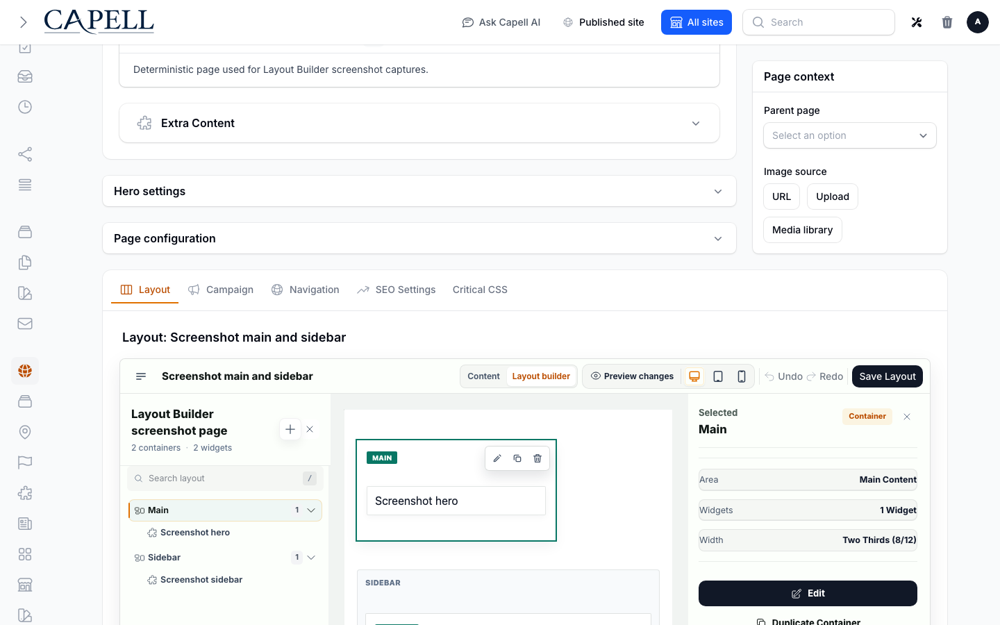
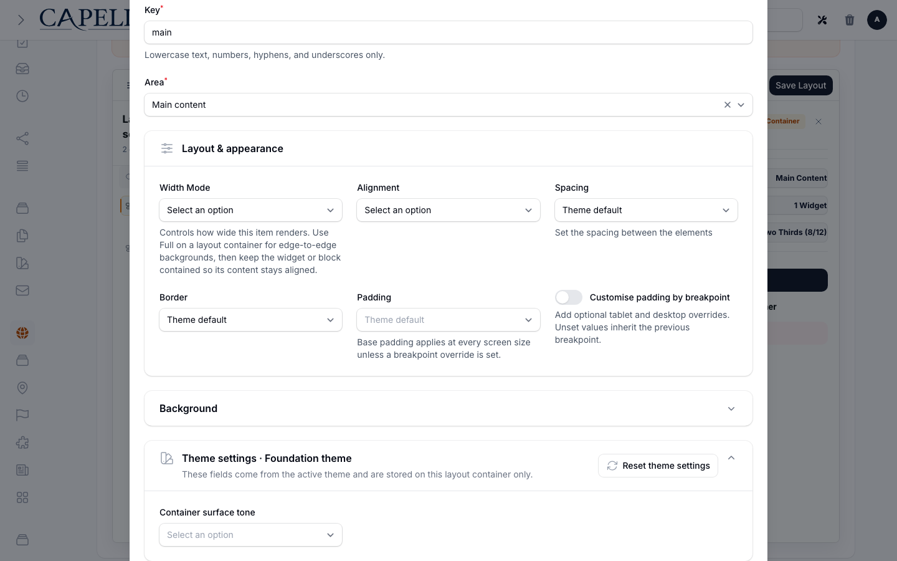
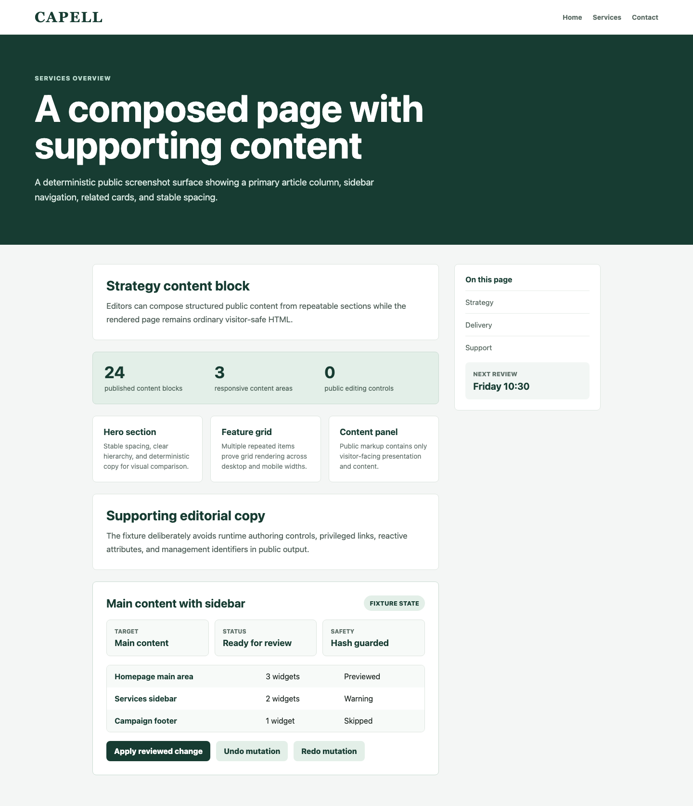

# Layout Builder

<!-- prettier-ignore-start -->

## What This Plugin Adds

Layout Builder owns the layout, widget, asset, preset, and public-snapshot state used to compose public pages. Core still owns the Page, Blueprint, and Theme records; Layout Builder works across that boundary rather than replacing Core's page model. It extends the admin, frontend, and console surfaces through `capell-app/layout-builder`.

Reach for it when page structure needs to change without creating a new template for every variation. The package turns reusable widgets and named layout areas into a public layout graph, keeping authoring state out of the rendered output. The capabilities below are supporting detail for that boundary, not a replacement for Core's Page, Blueprint, or Theme responsibilities.

### Main benefits

- **Compose pages visually.** Add, reorder, resize, and edit widgets inside named layout areas from the page editor.
- **Edit content without rearranging the page.** Content-first mode lets editors update widget text and assets before making structural changes.
- **Reuse approved patterns.** Save a container as a layout preset, insert it into another layout, or link a preset when several pages should share a pattern.
- **Tune responsive presentation.** Set container width, spacing, padding, borders, responsive overrides, and active-theme settings without changing the theme's source files.
- **Keep public rendering separate from authoring.** The public layout graph is built before rendering and excludes editor markers, signed editor URLs, and other authoring state.

### Additional capabilities

- Undo and redo layout mutations, with stale-save protection when another editor has changed the layout.
- Preview, approve, apply, and revert guided bulk changes to stored layout containers.
- Maintain linked preset usage and synchronisation records when a shared pattern changes.
- Serve lazy widget interaction targets from encrypted public snapshots with retention and revocation controls.
- Inspect widget usage, unused or disabled widgets, asset integrity, and layout health from the admin surface.

### Install first

- Install the package with `composer require capell-app/layout-builder`.
- Run `php artisan capell:layout-builder-install`.

The install command publishes the package migrations, runs host migrations, and publishes the admin assets. The host package setup lifecycle then creates the widget catalogue, content types, and starter layouts; there is no separate `capell:layout-builder-setup` command.

### Before you install

- Layout Builder requires `capell-app/core`, `capell-app/admin`, `capell-app/block-library`, and `capell-app/frontend`.
- It adds package migrations for layouts, widgets, assets, presets, bulk changes, and public widget snapshots.
- Run the host queue worker and scheduler if you use queued preset synchronisation, bulk changes, or the declared snapshot and bulk-change pruning schedules.

## Fair objections, answered honestly

**"How is this different from Content Sections or Structured Content Library?"** The package docs do not define a formal decision matrix, but they do define different units of responsibility. Use Layout Builder when the thing that changes is page composition: which reusable widgets appear in which named containers, and how those containers are presented. Use Content Sections when the thing that changes is a reusable, publishable section record that other content surfaces select and receive; its documentation describes editing one published section and updating every page that resolves it. Use Structured Content Library when the thing that changes is a typed reusable record such as a testimonial, team member, service, or FAQ; its documentation explicitly says it does not add a page, widget, route, or public template by itself. These packages can work together: Content Sections and structured records can be consumed from a Layout Builder composition.

**"Is the extension surface worth another dependency?"** The technical inventory lists 14 extension contracts. A new widget starts with `WidgetExtensionRegistrar`, a `WidgetExtensionDefinitionData`, a Filament widget, and typed input/render Data classes; batch payload, dependency, state-upcast, asset, and schema contracts are additional seams for cases that need them. That is a real interface surface to own and test. If your application only needs the package's built-in widgets and layouts, you may not touch most of those contracts, but installing Layout Builder still means taking on its migrations, models, admin surfaces, and public rendering boundary.

**"What if we only need a couple of static layouts?"** The package documentation does not describe a reduced static-layout mode or a smaller install path. If the requirement is fixed templates with no reusable widget composition, this README cannot claim that Layout Builder is the simpler option; compare the host application's existing Core, theme, and page-template path instead.

## Why It Matters

**For developers:** Layout Builder keeps page and blueprint records in Core while owning the layout, widget, asset, preset, and public-snapshot boundary. Extend it through typed contracts, `LayoutWidgetRegistry`, `WidgetExtensionRegistry`, and package Actions; the [worked extension examples](docs/extension-contracts.md) show the registration context and required method shapes.

**For teams:** Editors and agencies can assemble pages from approved widgets and reusable patterns, then publish the saved composition through the host site's normal public rendering path. A shared layout can affect several pages, so review the affected pages before saving structural changes.

Read [`docs/overview.admin.md`](docs/overview.admin.md) for the package boundary and [`docs/admin-guide.md`](docs/admin-guide.md) for editor tasks. The [widget extension guide](docs/widget-extensions.md) covers canonical widget registration, theme overrides, typed render data, and public-output boundaries.

## Screens And Workflow

The committed screenshot contract is [`docs/screenshots.json`](docs/screenshots.json). These captures show the primary editor path and the public result:

### A typical workflow

1. Open a page in the admin and use **Content first** to update existing widget content and assets.
2. Switch to the visual layout view when you need to add a widget, reorder content, or change a named container.
3. Set responsive or active-theme presentation values on the selected container, then preview the result.
4. Save the page. Layout Builder persists the layout through a transaction and builds the public layout graph without authoring markers.

## Content Composition

_The Page and its blueprint remain Core inputs. Layout Builder owns the areas, widget keys, widget definitions, and widget assets that `BuildPublicLayoutGraphAction` turns into a public layout graph; Frontend owns the final public render contract._

[Canonical Mermaid source](docs/images/content-composition.mmd)

What changes when you edit an article, its layout, or its theme? In this illustrative example, **A day on the coast** uses `main` for an article content widget and `sidebar` for a related-reading widget; these are example choices, not seeded defaults.

- **Content edit:** revise the article title or body in its blueprint-defined content; the example keeps its `main` and `sidebar` placements.
- **Layout edit:** move or reorder widget placements in the selected layout; this changes composition and may affect other pages sharing that layout.
- **Theme change:** change templates, typography, spacing and area presentation. Check the theme's available areas and widget support; switching themes does not guarantee an identical composition.

Source: [`BuildPublicLayoutGraphAction`](src/Actions/BuildPublicLayoutGraphAction.php) maps layout containers and ordered widgets into public data; [`LayoutLoader`](src/Support/Loader/LayoutLoader.php) resolves widgets and their assets. Page, Blueprint, Translation, Layout and Theme remain Core models; Widget and WidgetAsset belong to optional Layout Builder.

- Layout Builder visual editor with main and sidebar containers (admin, required evidence).
- Layout Builder content-first editing mode (admin, supplementary evidence).
- Layout Builder add widget action (admin, supplementary evidence).
- Layout Builder add container action (admin, supplementary evidence).
- Layout Builder edit widget action (admin, supplementary evidence).
- Layout Builder edit container action (admin, supplementary evidence).
- Layout Builder active-theme container settings (admin, required evidence).
- Layout Builder responsive padding controls on mobile (admin, required evidence).
- Layout Builder active-theme container settings on mobile (admin, required evidence).
- Layout Builder responsive preview (admin, supplementary evidence).
- Layout Builder tree selection (admin, supplementary evidence).
- Layout Builder filtered tree keyboard navigation (admin, supplementary evidence).
- Layout Builder preset action fixture (frontend, supplementary evidence).
- Layout Builder undo and redo actions fixture (frontend, supplementary evidence).
- Layout Builder bulk change criteria fixture (frontend, supplementary evidence).
- Layout Builder bulk change review fixture (frontend, supplementary evidence).
- Layout Builder main and sidebar admin example (admin, supplementary evidence).
- Layout Builder main and sidebar public example (frontend, supplementary evidence).
- Layout Builder full-width public example (frontend, supplementary evidence).
- Widgets admin index (admin, required evidence).
- Create and edit widget form with widget assets (admin, required evidence).
- Unused and disabled widget integrity state (admin, supplementary evidence).
- Broken and unscoped widget asset integrity states (admin, supplementary evidence).
- Sections admin index (admin, required evidence).
- Widgets admin index with admin sidebar menu open (admin, supplementary evidence).

## Works With

- [Content Sections](../content-sections/README.md): place reusable, publishable sections in layouts.
- [Frontend Authoring](../frontend-authoring/README.md): add authenticated in-page layout authoring to the frontend.
- [Publishing Studio](../publishing-studio/README.md): connect layout snapshots to publishing workflows.
- [Structured Content Library](../structured-content-library/README.md): place structured content records in layouts.

## Technical Shape

The package's technical inventory is below for maintainers and integrators. Use the linked guides for extension recipes and editor-facing procedures rather than copying internal classes into application code.

### At a glance

The inventory below lists 12 migration files, 11 model entries, and 14 extension contracts. For a new widget, the documented starting points are `WidgetExtensionRegistrar` with `WidgetExtensionDefinitionData`, plus typed input/render Data classes. Add `WidgetExtensionBatchPayloadResolver` only when the widget needs custom public payload resolution; the other contracts cover narrower asset, schema, dependency, state, and snapshot seams.

### Service providers

- `Capell\LayoutBuilder\LayoutBuilderServiceProvider`
- `AbstractFoundationWidgetServiceProvider`

### Config files

- `packages/layout-builder/config/capell-layout-builder.php`

### Migrations

- `packages/layout-builder/database/migrations/2026_05_10_190841_02_create_widgets_table.php`
- `packages/layout-builder/database/migrations/2026_05_10_190841_03_create_widget_assets_table.php`
- `packages/layout-builder/database/migrations/2026_05_10_190841_04_create_widget_widgets_table.php`
- `packages/layout-builder/database/migrations/2026_05_10_190841_05_add_container_widgets_to_layouts_table.php`
- `packages/layout-builder/database/migrations/2026_05_10_190841_06_create_layout_presets_table.php`
- `packages/layout-builder/database/migrations/2026_06_07_000001_create_layout_bulk_change_tables.php`
- `packages/layout-builder/database/migrations/2026_07_09_000001_create_public_widget_snapshots_table.php`
- `packages/layout-builder/database/migrations/2026_07_10_000001_add_linked_preset_fields_to_layout_presets_table.php`
- `packages/layout-builder/database/migrations/2026_07_10_000002_create_layout_preset_usages_table.php`
- `packages/layout-builder/database/migrations/2026_07_10_000003_create_layout_preset_sync_runs_table.php`
- `packages/layout-builder/database/migrations/2026_08_28_000003_change_widget_visibility_to_datetime.php`
- `packages/layout-builder/database/migrations/2026_09_01_000001_add_shadowed_by_workspace_id_to_widgets_table.php`

### Models

- `Layout`
- `LayoutBulkChangeResult`
- `LayoutBulkChangeRun`
- `LayoutPreset`
- `LayoutPresetSyncResult`
- `LayoutPresetSyncRun`
- `LayoutPresetUsage`
- `PublicWidgetSnapshot`
- `Widget`
- `WidgetAsset`
- `WidgetWidget`

### Filament classes

- `CreateWidgetAction`
- `ActionsRepeater`
- `AlignSelect`
- `AssetTypeSelect`
- `AssetsRepeater`
- `BackgroundSchema`
- `BorderSelect`
- `CarouselSettingsSchema`
- `ColorSchemeComponent`
- `ColumnInput`
- `ContainerWidthSelect`
- `CustomColorInput`
- `HeadingSizeSelect`
- `HeadingStyleSelect`
- `HtmlClassInput`
- `LayoutTab`
- `MarginSelect`
- `PaddingSelect`
- `HeroEditor`
- `LayoutTab`
- `PageModelSelect`
- `ResponsiveLayoutPatternSchema`
- `ResponsiveLayoutPatternSelect`
- `SizeSelect`
- `SpacingSelect`
- `TagSelect`
- `AdminSchema`
- `ComponentSection`
- `CreateDetailsSchema`
- `DisplaySection`
- `ResultsOverrideSchema`
- `ResultsSchema`
- `SettingsSchema`
- `WidgetAdminTab`
- `WidgetDisplayTab`
- `WidgetPresentationTabs`
- `WidgetSettingsTab`
- `TranslationsRepeater`
- `TypeSelect`
- `WidgetSelect`
- `DefaultLayoutContainerConfigurator`
- `DefaultLayoutWidgetConfigurator`
- `PageLayoutWidgetConfigurator`
- `ResultsLayoutWidgetConfigurator`
- `WidgetTypeConfigurator`
- `AbstractWidgetAssetConfigurator`
- `AssetsWidgetConfigurator`
- `CTASectionWidgetConfigurator`
- `CardGridWidgetConfigurator`
- `CarouselWidgetConfigurator`
- `DefaultWidgetConfigurator`
- `FeatureListWidgetConfigurator`
- `HeroBannerWidgetConfigurator`
- `HeroWidgetConfigurator`
- `ImageGalleryWidgetConfigurator`
- `KitchenSinkReferenceWidgetConfigurator`
- `ModernAlternatingContentConfigurator`
- `ModernCTASectionConfigurator`
- `ModernCardGridConfigurator`
- `ModernFaqConfigurator`
- `ModernFeatureListConfigurator`
- `ModernHeroBannerConfigurator`
- `ModernImageGalleryConfigurator`
- `ModernPricingTableConfigurator`
- `ModernProcessStepsConfigurator`
- `ModernStatsSectionConfigurator`
- `ModernTeamMembersConfigurator`
- `ModernTestimonialsConfigurator`
- `NavigationWidgetConfigurator`
- `PageContentWidgetConfigurator`
- `PageWidgetAssetForm`
- `RegisteredAssetWidgetAssetForm`
- `ResultsWidgetConfigurator`
- `SystemWidgetConfigurator`
- `HeroPageSchemaExtender`
- `LayoutBuilderResource`
- `LayoutPresetResource`
- `ListLayoutPresets`
- `LayoutResource`
- `CreateLayout`
- `EditLayout`
- `ListLayouts`
- `LayoutSchemaExtender`
- `LayoutsTable`
- `PageSchemaExtender`
- `PageSelectionTable`
- `CreateWidget`
- `EditWidget`
- `ListWidgets`
- `LayoutsRelationManager`
- `WidgetAssetsRelationManager`
- `WidgetAssetForm`
- `WidgetForm`
- `WidgetAssetsTable`
- `WidgetSelectionTable`
- `WidgetsTable`
- `WidgetResource`
- `LayoutHealthFilamentWidget`
- `RecentActivityFilamentWidget`

### Livewire components

- `AuthorizesLayoutBuilderAccess`
- `HasLayoutActions`
- `ManagesAssets`
- `ManagesContainers`
- `ManagesLayoutBuilderState`
- `ManagesWidgets`
- `LayoutBuilder`
- `ModalTableSelect`
- `LayoutBuilderActionFactory`

### Policies

- `LayoutPresetPolicy`

### Extension contracts

- `PublicLayoutWidgetAssetsRenderer`
- `LayoutContainerSchemaExtender`
- `WidgetAssetSchemaExtender`
- `WidgetSchemaExtender`
- `LayoutContainerThemePresentationProjector`
- `LayoutContentGroupContributor`
- `LayoutSidebarWidgetContributor`
- `PublicLayoutWidgetPayloadContributor`
- `PublicLayoutWidgetPayloadResolver`
- `WidgetAssetReferenceRepointer`
- `WidgetExtensionBatchPayloadResolver`
- `WidgetExtensionDependencyResolver`
- `WidgetExtensionStateUpcaster`
- `WidgetSnapshotLocatorCipher`

### Listeners

- `AfterRecordSaved`
- `LayoutLoaded`
- `MaintainPublicWidgetSnapshotsListener`
- `SiteTreeRebuilt`
- `TypeValidated`

### Actions

- `AddHeroWidgetToLayoutAction`
- `AddWidgetToLayoutContainerAction`
- `AnalyzeLayoutDiagnosticsAction`
- `AnalyzeLayoutHealthAction`
- `ApplyLayoutPresetAction`
- `ApplyLayoutSidebarWidgetContributionsAction`
- `ApplyStarterLayoutPresetAction`
- `AttachWidgetToLayoutAreaAction`
- `BuildLayoutBuilderTreeAction`
- `BuildLayoutContentInventoryAction`
- `BuildLayoutHealthWorkQueueAction`
- `BuildPublicLayoutGraphAction`
- `BuildWidgetDeletionImpactAction`
- `BuildWidgetVisualRegressionManifestAction`
- `ApplyLayoutBulkChangeRunAction`
- `ApplyLayoutWidgetOperationToContainersAction`
- `PreviewLayoutBulkChangeAction`
- `QueueLayoutBulkChangeRunAction`
- `ResolveLayoutBulkChangeTargetsAction`
- `RevertLayoutBulkChangeRunAction`
- `ScopeLayoutBulkChangeQueryForActorAction`
- `CountLinkedLayoutPresetUsagesAction`
- `CreateHeroWidgetAction`
- `CreateLayoutBuilderDemoSiteAction`
- `CreateLayoutPresetSyncRunAction`
- `CreateLinkedLayoutPresetAction`
- `FindReusableWidgetsAction`
- `BuildLayoutBuilderFragmentReferenceAction`
- `RenderPublicFragmentAction`
- `ResolveLayoutBuilderFragmentWidgetVersionAction`
- `GenerateLayoutPreviewImageAction`
- `GetLayoutPreviewImageUrlAction`
- `GetWidgetContainerWidthAction`
- `HeroWidgetHasPrimaryHeadingAction`
- `InsertLinkedLayoutPresetAction`
- `InstallLayoutBuilderPackageAction`
- `InstallLayoutBuilderWidgetCatalogAction`
- `InstallPackageAction`
- `InvalidateLayoutPreviewImageAction`
- `InvalidateTypeLayoutPreviewImagesAction`
- `InvalidateWidgetLayoutPreviewImagesAction`
- `BuildLayoutWidgetResourceUsagesAction`
- `RenderLazyLayoutWidgetAction`
- `LinkLayoutPresetContainerAction`
- `ListLayoutPresetsAction`
- `MakeWidgetAction`
- `CreateLayoutFragmentAction`
- `NormalizeLayoutBuilderStateAction`
- `PasteLayoutFragmentAction`
- `PushLayoutMutationSnapshotAction`
- `RedoLayoutMutationSnapshotAction`
- `ReorderLayoutContainerAction`
- `ReorderLayoutWidgetAction`
- `ResizeLayoutContainerAction`
- `UndoLayoutMutationSnapshotAction`
- `NormalizeLayoutContainerPaddingAction`
- `PersistLayoutBuilderStateAction`
- `PreviewLayoutPlanAction`
- `PruneLayoutBulkChangeRunsAction`
- `PublishLayoutBuilderAdminAssetsAction`
- `RenderAdminLayoutPreviewAction`
- `RepointWidgetAssetReferencesAction`
- `ResetLayoutContainerThemeSettingsAction`
- `ResolveAdminWidgetPreviewDataAction`
- `ResolveLayoutAreaContainersAction`
- `ResolveLayoutContainerPresentationAction`
- `ResolvePublicWidgetAssetsAction`
- `ResolvePublicWidgetRenderContextAction`
- `ResolveWidgetPresentationDataAction`
- `RunLinkedLayoutPresetSyncAction`
- `SaveFormComponentRelationshipAction`
- `SaveLayoutPresetAction`
- `SeedWidgetIntegrityScreenshotFixturesAction`
- `SetupLayoutBuilderPackageAction`
- `StripLayoutPresetLinkAction`
- `SummarizeLayoutChangesAction`
- `SyncLayoutPresetUsagesAction`
- `UpdateLinkedLayoutPresetItemAction`
- `WidgetContractValidatorAction`
- `BuildPublicWidgetPayloadsAction`
- `RenderPublicWidgetExtensionAction`
- `ResolveWidgetExtensionDependenciesAction`
- `RestoreWidgetInteractionContextAction`
- `WidgetIsSlotAction`
- `BuildPublicWidgetInteractionLocatorsAction`
- `PrunePublicWidgetSnapshotsAction`
- `RebuildPublicWidgetSnapshotsAction`
- `ResolvePublicWidgetSnapshotAction`
- `RevokePublicWidgetSnapshotsAction`
- `WithdrawPublicWidgetSnapshotsAction`

### Data objects

- `AdminLayoutPreviewData`
- `AdminWidgetPreviewData`
- `ActivityItemData`
- `LayoutHealthData`
- `LayoutHealthWorkQueueItemData`
- `LeastUsedWidgetData`
- `RecentActivityData`
- `UnusedWidgetData`
- `WidgetGroupData`
- `DemoSitePlanData`
- `LayoutAssetBridgeData`
- `LayoutBuilderStateData`
- `LayoutBuilderTreeContainerData`
- `LayoutBuilderTreeData`
- `LayoutBuilderTreeWidgetData`
- `LayoutBulkChangeCriteriaData`
- `LayoutBulkWidgetOperationData`
- `LayoutBulkWidgetOperationResultData`
- `LayoutChangeData`
- `LayoutContainerPresentationData`
- `LayoutContainerResponsivePaddingData`
- `LayoutContainerSchemaContextData`
- `LayoutContainerThemePresentationData`
- `LayoutContentGroupData`
- `LayoutContentInventoryContextData`
- `LayoutContentInventoryData`
- `LayoutContentItemData`
- `LayoutDiagnosticData`
- `LayoutFragmentData`
- `LayoutMutationHistoryData`
- `LayoutMutationNavigationData`
- `LayoutMutationResultData`
- `LayoutPlanData`
- `LayoutPlanResultData`
- `LayoutPresetData`
- `LayoutPresetLinkData`
- `LayoutSidebarWidgetData`
- `LayoutWidgetCatalogDefinitionData`
- `LayoutWidgetDefinitionData`
- `PublicFragmentRenderResultData`
- `PublicLayoutContainerData`
- `PublicLayoutGraphData`
- `PublicLayoutWidgetData`
- `PublicWidgetRenderContextData`
- `DiscoveredWidgetExtensionData`
- `WidgetExtensionCapabilitiesData`
- `WidgetExtensionCollisionData`
- `WidgetExtensionDefinitionData`
- `WidgetExtensionDependencyData`
- `WidgetExtensionPayloadBatchData`
- `WidgetExtensionPayloadInputData`
- `WidgetExtensionRenderContextData`
- `WidgetLayoutUsageData`
- `WidgetScaffoldData`
- `WidgetSnapshotLocatorData`

### Jobs

- `ApplyLayoutBulkChangeRunJob`
- `SyncLinkedLayoutPresetJob`

### Command signatures

- `capell:layout-builder-install`
- `capell:layout-builder:prune-bulk-change-runs`

### Manifest action API

- `install: Capell\LayoutBuilder\Actions\InstallLayoutBuilderPackageAction`
- `pruneLayoutBulkChangeRuns: Capell\LayoutBuilder\Actions\PruneLayoutBulkChangeRunsAction`
- `setup: Capell\LayoutBuilder\Actions\SetupLayoutBuilderPackageAction`

### Scheduled commands

- `capell:layout-builder:prune-bulk-change-runs (daily; manifest declared)`
- `capell:widget-snapshots:prune (daily; manifest declared)`

### Console command classes

- `InstallCommand`
- `LayoutBulkChangeCommand`
- `PruneLayoutBulkChangeRunsCommand`
- `PrunePublicWidgetSnapshotsCommand`
- `ResyncLayoutPresetCommand`
- `WidgetVisualRegressionCommand`

### Manifest contributions

- `admin-resource: Capell\LayoutBuilder\Support\LayoutBuilderAdminRegistrar`
- `asset: Capell\LayoutBuilder\Support\LayoutBuilderAdminRegistrar`
- `configurator: Capell\LayoutBuilder\Support\LayoutBuilderAdminRegistrar`
- `migration: Capell\LayoutBuilder\Manifest\LayoutBuilderMigrationsContribution`
- `model: Capell\LayoutBuilder\Manifest\LayoutBuilderModelsContribution`
- `page-type: Capell\LayoutBuilder\Manifest\LayoutBuilderPageTypesContribution`
- `route: Capell\LayoutBuilder\Manifest\LayoutBuilderRoutesContribution`
- `scheduled-job: Capell\LayoutBuilder\Manifest\LayoutBuilderBulkChangePruneScheduleContribution`
- `scheduled-job: Capell\LayoutBuilder\Manifest\LayoutBuilderSnapshotPruneScheduleContribution`
- `schema-extender: Capell\LayoutBuilder\Support\LayoutBuilderAdminRegistrar`

### Health checks

- `Capell\LayoutBuilder\Health\LayoutBuilderHealthCheck`

### Blade views

- `packages/layout-builder/resources/views/components/filament/layout-builder/asset.blade.php`
- `packages/layout-builder/resources/views/components/filament/layout-builder/assets.blade.php`
- `packages/layout-builder/resources/views/components/filament/layout-builder/container.blade.php`
- `packages/layout-builder/resources/views/components/filament/layout-builder/drag-handle-icon.blade.php`
- `packages/layout-builder/resources/views/components/filament/layout-builder/widget.blade.php`
- `packages/layout-builder/resources/views/components/infolists/entries/layout-widget.blade.php`
- `packages/layout-builder/resources/views/components/infolists/entries/layout-widgets.blade.php`
- `packages/layout-builder/resources/views/components/layout-widget-assets.blade.php`
- `packages/layout-builder/resources/views/components/layout-widgets/content.blade.php`
- `packages/layout-builder/resources/views/components/layout-widgets/extension-gated.blade.php`
- `packages/layout-builder/resources/views/components/layout-widgets/extension-unavailable.blade.php`
- `packages/layout-builder/resources/views/components/layout-widgets/image.blade.php`
- `packages/layout-builder/resources/views/components/layout-widgets/index.blade.php`
- `packages/layout-builder/resources/views/components/layout-widgets/interaction-target.blade.php`
- `packages/layout-builder/resources/views/components/layout-widgets/runtime-wrapper.blade.php`
- `packages/layout-builder/resources/views/components/layout-widgets/title.blade.php`
- `packages/layout-builder/resources/views/components/layout/area.blade.php`
- `packages/layout-builder/resources/views/components/layout/container.blade.php`
- `packages/layout-builder/resources/views/components/layout/main-content.blade.php`
- `packages/layout-builder/resources/views/components/layout/widget.blade.php`
- `packages/layout-builder/resources/views/filament/actions/layout-bulk-change-review.blade.php`
- `packages/layout-builder/resources/views/filament/layout-builder/admin-preview/container.blade.php`
- `packages/layout-builder/resources/views/filament/layout-builder/admin-preview/page.blade.php`
- `packages/layout-builder/resources/views/filament/layout-builder/admin-preview/widget-fallback.blade.php`
- `packages/layout-builder/resources/views/filament/layout-builder/previews/default.blade.php`
- `packages/layout-builder/resources/views/filament/layout-builder/previews/page-content.blade.php`
- `packages/layout-builder/resources/views/filament/resources/widgets/widget-card.blade.php`
- `packages/layout-builder/resources/views/filament/widgets/layout-health.blade.php`
- `packages/layout-builder/resources/views/filament/widgets/recent-activity.blade.php`
- `packages/layout-builder/resources/views/frontend-authoring/filament-shell-assets.blade.php`
- `packages/layout-builder/resources/views/frontend-authoring/layout-builder-editor.blade.php`
- `packages/layout-builder/resources/views/livewire/filament/layout-builder/content-first.blade.php`
- `packages/layout-builder/resources/views/livewire/filament/layout-builder/index.blade.php`
- `packages/layout-builder/resources/views/livewire/filament/layout-builder/visual-editor-markup.blade.php`
- `packages/layout-builder/resources/views/livewire/filament/layout-builder/visual-editor.blade.php`
- `packages/layout-builder/resources/views/livewire/filament/layout-builder/visual-tree.blade.php`
- `packages/layout-builder/resources/views/livewire/filament/layout-builder/widgets-table-select.blade.php`

### Cache tags

- `layout-builder`

## Data Model

- Required tables: `layouts`, `widgets`, `widget_assets`, `widget_widgets`, `layout_presets`, `layout_bulk_change_runs`, `layout_bulk_change_results`, `layout_preset_usages`, `layout_preset_sync_runs`, `layout_preset_sync_results`, `public_widget_snapshots`.
- Models: `Layout`, `LayoutBulkChangeResult`, `LayoutBulkChangeRun`, `LayoutPreset`, `LayoutPresetSyncResult`, `LayoutPresetSyncRun`, `LayoutPresetUsage`, `PublicWidgetSnapshot`, `Widget`, `WidgetAsset`, `WidgetWidget`.
- Core record references in migrations: `sites via site_id`, `languages via language_id`, `layouts via layout_id`, `widgets via widget_id`, `themes via theme_id`.
- Migration files: `2026_05_10_190841_02_create_widgets_table.php`, `2026_05_10_190841_03_create_widget_assets_table.php`, `2026_05_10_190841_04_create_widget_widgets_table.php`, `2026_05_10_190841_05_add_container_widgets_to_layouts_table.php`, `2026_05_10_190841_06_create_layout_presets_table.php`, `2026_06_07_000001_create_layout_bulk_change_tables.php`, `2026_07_09_000001_create_public_widget_snapshots_table.php`, `2026_07_10_000001_add_linked_preset_fields_to_layout_presets_table.php`, `2026_07_10_000002_create_layout_preset_usages_table.php`, `2026_07_10_000003_create_layout_preset_sync_runs_table.php`, `2026_08_28_000003_change_widget_visibility_to_datetime.php`, `2026_09_01_000001_add_shadowed_by_workspace_id_to_widgets_table.php`.
- Migration impact: run host migrations through the package install flow before opening package surfaces.
- Deletion/retention behaviour: migrations declare cascade-on-delete relationships and null-on-delete relationships; retention is scheduled through `capell:widget-snapshots:prune` (daily; declared in the manifest) and `capell:layout-builder:prune-bulk-change-runs` (daily; declared in the manifest).

## Install Impact

- Required packages: `capell-app/core`, `capell-app/admin`, `capell-app/block-library`, `capell-app/frontend`.
- Admin navigation: declares `admin-resource: LayoutBuilderAdminRegistrar`; each Filament page or resource controls its own navigation visibility.
- Admin/editor extensions: `configurator: LayoutBuilderAdminRegistrar`, `schema-extender: LayoutBuilderAdminRegistrar`.
- Permissions: `ViewAny:Layout`, `View:Layout`, `Create:Layout`, `EditContent:Layout`, `EditLayout:Layout`, `Update:Layout`, `Delete:Layout`, `DeleteAny:Layout`, `Restore:Layout`, `ForceDelete:Layout`, `Replicate:Layout`, `Reorder:Layout`, `BulkMutate:Layout`; access also governed by package policies: `LayoutPresetPolicy`.
- Public routes: registers `LayoutBuilderRoutesContribution`.
- Database changes: package migrations are declared.
- Config: `config/capell-layout-builder.php`.
- Settings: no package settings declared.
- Queues or schedules: scheduled commands `capell:layout-builder:prune-bulk-change-runs (daily; manifest declared)`, `capell:widget-snapshots:prune (daily; manifest declared)`; queue jobs `ApplyLayoutBulkChangeRunJob`, `SyncLinkedLayoutPresetJob`.
- Cache tags: `layout-builder`.
- Commands: `capell:layout-builder-install`, `capell:layout-builder:prune-bulk-change-runs`.

## Common Pitfalls

- Keep required Capell packages on compatible v4 releases: `capell-app/core`, `capell-app/admin`, `capell-app/block-library`, `capell-app/frontend`.
- Run migrations before opening package resources or public routes.
- Review package configuration before production-like verification: `config/capell-layout-builder.php`.
- Keep the host Laravel scheduler running so package-registered schedules can execute: `capell:layout-builder:prune-bulk-change-runs (daily; manifest declared)`, `capell:widget-snapshots:prune (daily; manifest declared)`.
- Keep public Blade and cached HTML free of authoring markers, model IDs, permissions, signed editor URLs, and lazy database queries.
- Custom write integrations must preserve invalidation for `layout-builder` cache tags.

## Troubleshooting

| Symptom | Likely cause | Check | Fix |
| --- | --- | --- | --- |
| Package surface is missing after install | Provider or manifest is not loaded | Confirm `capell.json`, package `composer.json`, and provider registration | Reinstall the package, refresh Composer autoload, and clear host caches |
| Admin screen or command fails on missing table | Package migrations have not run | Check the tables listed in `Data Model` | Run host migrations and rerun the focused package test |
| Background work does not run | Queue worker or declared schedule is not active | Check the jobs and scheduled commands listed in `Technical Shape` | Start the queue worker or host scheduler, then run the focused command or package test |
| Public output leaks unexpected state | Render data, cache variation, or authoring boundary has regressed | Check public Blade, cache tags, and public-output safety tests | Move data loading out of Blade and rerun the package public-output tests |

## Quick Start

1. Install the package: `composer require capell-app/layout-builder`.
2. Run the package setup: `php artisan capell:layout-builder-install`.
3. Open the package admin surface at `/screenshot-fixtures/layout-builder-admin-editor` and confirm Layout Builder is available.

## Next Steps

- [Package docs](docs/README.md)
- [Overview](docs/overview.md)
- [Worked extension examples](docs/extension-contracts.md)
- [Admin guide](docs/admin-guide.md)
- Configuration files: [`config/capell-layout-builder.php`](config/capell-layout-builder.php).
- [Troubleshooting](#troubleshooting)
- [Screenshot contract](docs/screenshots.json)
- [Marketplace assets](docs/assets/marketplace/)
- [Capell content language plan](../../docs/CONTENT_LANGUAGE_PLAN.md)
- [Capell documentation design system](../../docs/DESIGN_SYSTEM.md)
- [Capell and package ERD notes](../../docs/erd/capell-and-package-erds.md)
- Related packages: [Block Library](../block-library/README.md), [Content Sections](../content-sections/README.md), [Frontend Authoring](../frontend-authoring/README.md), [Publishing Studio](../publishing-studio/README.md), [Structured Content Library](../structured-content-library/README.md).
- Focused tests: `vendor/bin/pest packages/layout-builder/tests --configuration=phpunit.xml`.

<!-- prettier-ignore-end -->
