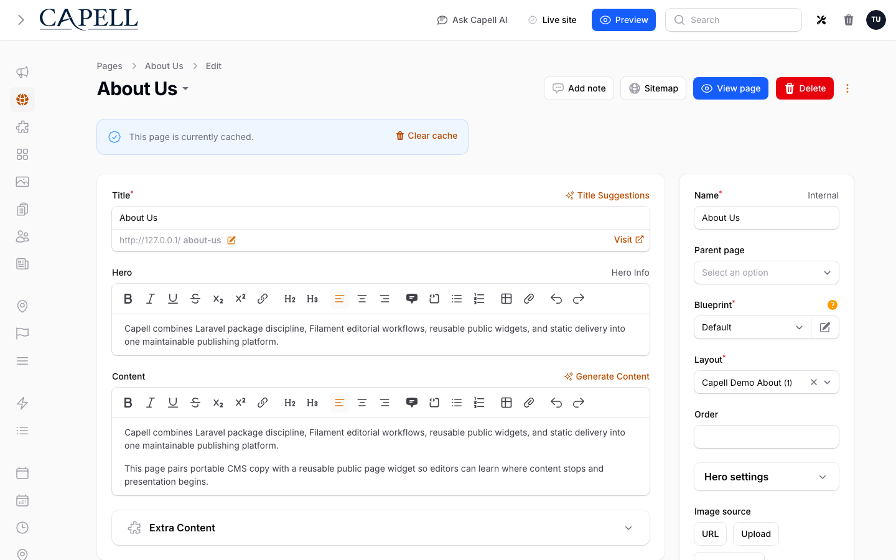
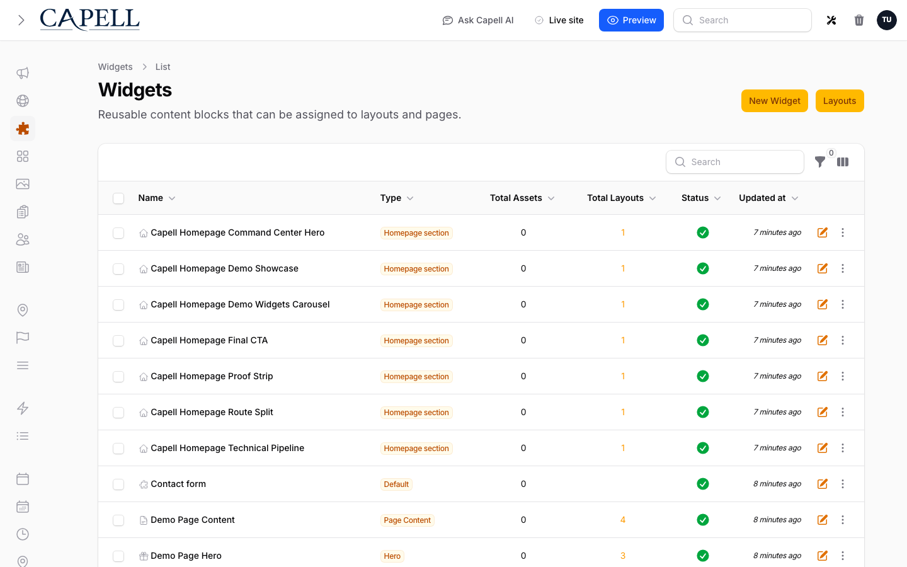
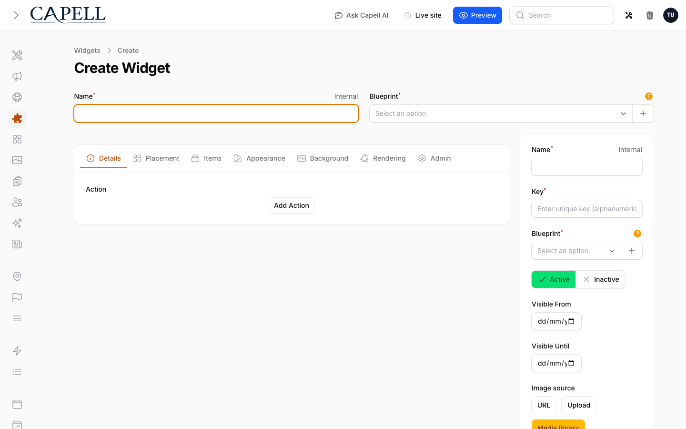
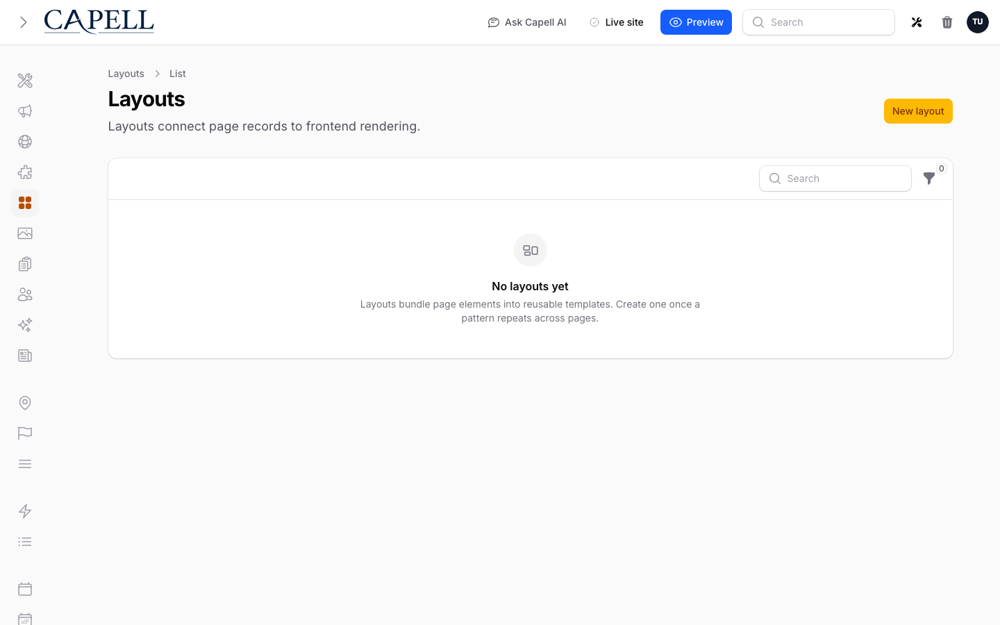

# Using Layout Builder

This guide is for editors who build pages and owners deciding how to use widgets and sections. Every step uses the labels you see on screen.

## Using Layout Builder (editor how-to)

### How to add a widget to a page

1. Open the page you want to edit in the admin.
2. From the **widget panel**, drag a widget (for example a text block, image, or button) onto your page.
3. Drop it where you want it to appear.
4. Save the page.

### How to edit a widget's text, image, or colour

1. Click the widget on the page.
2. Change its **text**, swap its **image**, or pick a **colour** in the panel that opens.
3. Save the page.

### How to reorder widgets

1. In the page editor, drag a widget up or down.
2. Drop it in its new position.
3. Save the page. The new order shows on the live site.

### How to upload an image or file for a widget

1. Click the widget, then the image or file field.
2. Upload a new file, or pick one you have used before.
3. Save the page.

### How to manage reusable widgets

1. Go to the **Widgets** list to see your reusable widgets by component, usage, and status, and to search or filter them.

2. Open a widget to set its component, display settings, translations, and widget assets.
3. Save the widget so it is ready to drop onto pages.

### How to reuse a block with Save as section

1. Arrange the widgets you want to reuse.
2. Click **Save as section** and give the section a clear name.
3. On another page, add that section from your section library instead of rebuilding it.

### How to review your sections

1. Open the **Layouts** list to review your saved sections and layout records.
2. Use it to see what reusable sections exist before building a new page.

## Rolling out Layout Builder (for owners)

### Turn on first

- **Pages with a few core widgets.** Start with text, image, and button widgets so editors get comfortable building and arranging pages before you introduce more advanced blocks.

### Add when needed

| Need                         | Enable                                             |
| ---------------------------- | -------------------------------------------------- |
| The same block on many pages | Save it once with **Save as section** and reuse it |
| Richer page sections         | Add more widget types as your team is ready        |

### Don't enable yet

- Hold back the full widget set on day one. A long panel of unfamiliar blocks slows new editors down.

### Who does what

| Role       | First useful screen                                   |
| ---------- | ----------------------------------------------------- |
| Editor     | The page editor: add and arrange widgets              |
| Site owner | The **Widgets** list: see the reusable widgets in use |

## Troubleshooting for editors

| What you see                           | What it means                                              | What to do                                                         |
| -------------------------------------- | ---------------------------------------------------------- | ------------------------------------------------------------------ |
| A widget isn't where I dropped it      | The page wasn't saved, or another widget shifted it        | Drag it back into place and save the page                          |
| My change isn't on the live page       | The page is still serving a cached copy                    | Wait a moment, or ask whoever manages caching to clear that page   |
| I can't find a block I built before    | It wasn't saved as a section                               | Rebuild it and use **Save as section** so it is reusable next time |
| The image looks wrong on the live site | The wrong file was picked, or it needs a moment to process | Re-open the widget, confirm the image, and save again              |
