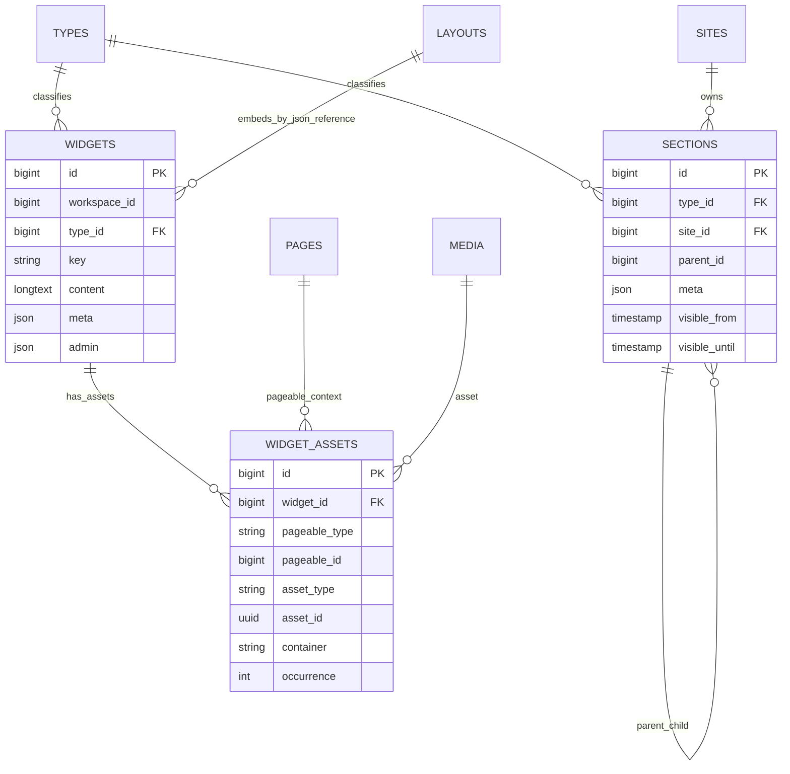

# Mosaic

Status: **Available, schema-owning** · Kind: **package** · Tier: **free** · Bundle: **foundation** · Contexts: **admin, frontend** · Product group: **Capell Foundation**

This page is the consolidated implementation overview for the Mosaic package. It is extracted from the package README, service providers, migrations, config files, routes, resources, models, actions, and the shared Capell ERD notes where available.

## What This Plugin Adds

Mosaic adds reusable widgets, sections, layout containers, widget assets, layout planning, and frontend widget rendering to Capell.

- Widget and section Filament resources.
- Layout and page schema extenders.
- Modern widget configurators for hero, card grids, FAQs, galleries, pricing, process steps, stats, teams, and testimonials.
- Actions for layout plans, widget creation, reusable widget lookup, and layout placement.
- Commands for install, setup, widget scaffolding, demo, faker, and upgrades.

## Developer Notes

Provides the package-based layout and widget foundation used by Blog, Campaigns, content blocks, and theme integrations.

- MosaicServiceProvider registers widgets, schemas, views, config, commands, and extension hooks.
- Config file: capell-mosaic.php.
- Migrations create widgets, widget_assets, sections, and add container widgets to layouts.
- Models include Widget, WidgetAsset, and Section.
- Filament resources cover widgets and sections.
- CapellLayout facade supports layout rendering concerns.

## Operational Notes

Lets editors build structured pages from reusable sections and widgets instead of editing raw templates.

- Adds widgets, widget_assets, and sections tables.
- Extends page and layout admin forms.
- Adds widget and section admin navigation.
- Adds layout builder lazy-loading config.
- May affect page cache and layout rendering.

## Data And Retention

- widgets stores workspace, type, key, content, meta, and admin JSON.
- widget_assets connects widgets to media and pageable context.
- sections stores site, type, parent, meta, and visibility windows.
- layouts can store container widget references after migration.
- Mosaic connects to core types, sites, layouts, pages, and media.

## Screenshot Plan

- Widgets admin index.
- Create/edit widget form.
- Sections admin index.
- Layout builder screen.
- Frontend page rendering Mosaic widgets.

## Pitfalls

- Run Mosaic install before Blog or other widget-dependent packages.
- Keep widget types and configurators registered together.
- Check layout cache after changing widgets.

## Verification

- Run `vendor/bin/pest packages/mosaic/tests` when package tests exist.
- Run the relevant host-app migration or package install flow in a disposable database.
- Open the listed admin or frontend surface and compare it with the screenshot plan.

## Package Manifest

- Composer name: `capell-app/mosaic`
- Product group: Capell Foundation
- Kind: package
- Tier: free
- Bundle: foundation
- Contexts: `admin`, `frontend`
- Requires: `capell-app/admin`, `capell-app/frontend`, `capell-app/workspaces`
- Optional dependencies: None listed.

## Admin Surfaces

- LayoutResource (packages/mosaic/src/Filament/Resources/Layouts/LayoutResource.php)
- CreateSection (packages/mosaic/src/Filament/Resources/Sections/Pages/CreateSection.php)
- EditSection (packages/mosaic/src/Filament/Resources/Sections/Pages/EditSection.php)
- ListSections (packages/mosaic/src/Filament/Resources/Sections/Pages/ListSections.php)
- SectionResource (packages/mosaic/src/Filament/Resources/Sections/SectionResource.php)
- CreateWidget (packages/mosaic/src/Filament/Resources/Widgets/Pages/CreateWidget.php)
- EditWidget (packages/mosaic/src/Filament/Resources/Widgets/Pages/EditWidget.php)
- ListWidgets (packages/mosaic/src/Filament/Resources/Widgets/Pages/ListWidgets.php)
- WidgetResource (packages/mosaic/src/Filament/Resources/Widgets/WidgetResource.php)

## Commands

- `capell:mosaic-demo {--user= : Whether to associate the created demo content with the first user in the system. If not provided, content will be created without an associated user.} {--sites= : Comma-separated list of site names to target for demo content insertion. If not provided, all sites will be targeted.} {--skip-hero : Skip hero demo content after creating mosaic demo content.}` (packages/mosaic/src/Console/Commands/DemoCommand.php)
- `capell:mosaic-faker {--count=25} {--force}` (packages/mosaic/src/Console/Commands/FakerCommand.php)
- `capell:hero-demo {--sites=}` (packages/mosaic/src/Console/Commands/Hero/DemoCommand.php)
- `capell:hero-setup` (packages/mosaic/src/Console/Commands/Hero/SetupCommand.php)
- `capell:mosaic-install` (packages/mosaic/src/Console/Commands/InstallCommand.php)
- `capell:mosaic-make-widget {name : The widget name (e.g. HeroBanner)} {--livewire : Also scaffold a Livewire widget class and view} {--F|force : Overwrite existing files after warning}` (packages/mosaic/src/Console/Commands/MakeWidgetCommand.php)
- `capell:mosaic-setup {--user= : Ignored — accepted for compatibility with capell:install} {--sites= : Ignored — accepted for compatibility with capell:install} {--languages= : Ignored — accepted for compatibility with capell:install} {--url= : Ignored — accepted for compatibility with capell:install}` (packages/mosaic/src/Console/Commands/SetupCommand.php)
- `capell:mosaic-upgrade` (packages/mosaic/src/Console/Commands/UpgradeCommand.php)

## Routes And Config

- Config: packages/mosaic/config/capell-mosaic.php

## Permissions And Gates

- Gate: LayoutHealthWidgetAbstract: `super_admin`
- Gate: RecentActivityWidgetAbstract: `admin`, `super_admin`

## Migrations

- Migration: 2026_04_20_000001_create_widgets_table.php
- Migration: 2026_04_20_000002_create_widget_assets_table.php
- Migration: add_container_widgets_to_layouts_table.php
- Migration: create_sections_table.php

## ERD Excerpt

## Screenshot Automation

Deployment should read [screenshots.json](screenshots.json), install the package with demo data, resolve each admin surface or frontend URL, and write images to `public/docs/screenshots/packages/mosaic`.

- Widgets admin index.
- Create/edit widget form.
- Sections admin index.
- Layout builder screen.
- Frontend page rendering Mosaic widgets.
