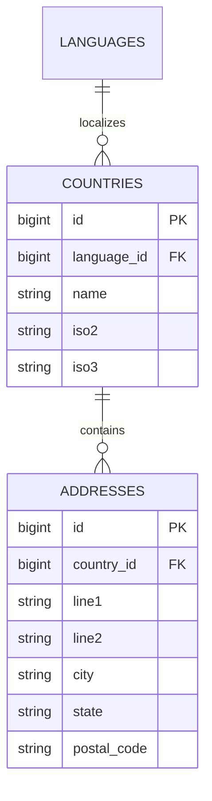

# Address

Status: **Available, schema-owning** · Kind: **package** · Tier: **free** · Bundle: **foundation** · Contexts: **admin** · Product group: **Capell Foundation**

This page is the consolidated implementation overview for the Address package. It is extracted from the package README, service providers, migrations, config files, routes, resources, models, actions, and the shared Capell ERD notes where available.

## What This Plugin Adds

Address adds reusable countries, address records, address selectors, country selectors, and flag rendering to the Capell admin surface.

- Filament resources for countries and addresses.
- Address, country, and flag form components for other packages.
- Site schema extension support where address details are needed.
- Install, demo, and faker commands for local package data.

## Developer Notes

Provides Country and Address models, typed address metadata, Filament configurators, observers, and support classes for URL and flag rendering.

- AddressServiceProvider registers the package.
- Migrations create countries and addresses.
- Models: Country and Address.
- Filament resources: CountryResource and AddressResource.
- Form components: AddressSelect, CountrySelect, FlagSelect.
- Observers keep model state consistent.

## Operational Notes

Keeps location data consistent across structured websites instead of duplicating country and address fields in separate features.

- Adds country and address admin navigation.
- Adds database tables for countries and addresses.
- Adds address/country form components for package developers.
- No public route is registered by this package.

## Data And Retention

- countries stores localized country names with iso2 and iso3 codes.
- addresses stores line, city, state, postal code, and country relationship data.
- Countries connect to core languages.
- Deletion behaviour should be verified before documenting cascading rules.

## Screenshot Plan

- Countries admin index.
- Addresses admin index.
- Create/edit country form.
- Create/edit address form.
- Site settings fields where address data is injected.

## Pitfalls

- Run migrations before opening the resources.
- Seed or import countries before expecting useful address form-builder.
- Check language records before relying on localized country names.

## Verification

- Run `vendor/bin/pest packages/address/tests` when package tests exist.
- Run the relevant host-app migration or package install flow in a disposable database.
- Open the listed admin or frontend surface and compare it with the screenshot plan.

## Package Manifest

- Composer name: `capell-app/address`
- Product group: Capell Foundation
- Kind: package
- Tier: free
- Bundle: foundation
- Contexts: `admin`
- Requires: `capell-app/admin`
- Optional dependencies: None listed.

## Admin Surfaces

- AddressResource (packages/address/src/Filament/Resources/Addresses/AddressResource.php)
- ManageAddresses (packages/address/src/Filament/Resources/Addresses/Pages/ManageAddresses.php)
- CountryResource (packages/address/src/Filament/Resources/Countries/CountryResource.php)
- ManageCountries (packages/address/src/Filament/Resources/Countries/Pages/ManageCountries.php)

## Commands

- `capell:address-demo {--sites=}` (packages/address/src/Console/Commands/DemoCommand.php)
- `capell:address-faker {--count=25} {--force}` (packages/address/src/Console/Commands/FakerCommand.php)
- `capell:address-install` (packages/address/src/Console/Commands/InstallCommand.php)

## Routes And Config

- None proven in this package directory.

## Permissions And Gates

- None proven in this package directory.

## Migrations

- Migration: 2026_04_20_000001_create_countries_table.php
- Migration: 2026_04_20_000002_create_addresses_table.php

## ERD Excerpt

## Screenshot Automation

Deployment should read [screenshots.json](screenshots.json), install the package with demo data, resolve each admin surface or frontend URL, and write images to `public/docs/screenshots/packages/address`.

- Countries admin index.
- Addresses admin index.
- Create/edit country form.
- Create/edit address form.
- Site settings fields where address data is injected.
