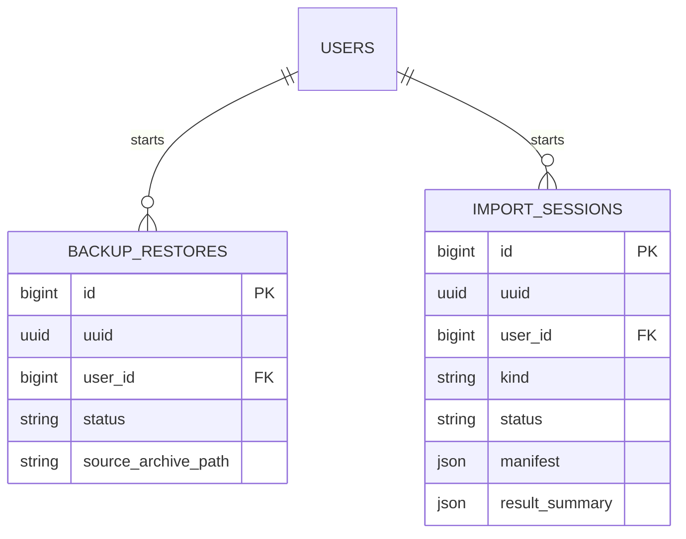

# Backup

Status: **Available, schema-owning** · Kind: **package** · Tier: **premium** · Bundle: **operations** · Contexts: **admin, console** · Product group: **Capell Operations**

This page is the consolidated implementation overview for the Backup package. It is extracted from the package README, service providers, migrations, config files, routes, resources, models, actions, and the shared Capell ERD notes where available.

## What This Plugin Adds

Backup provides package export, import, restore, WordPress import, dependency graph, and validation workflows for Capell content operations.

- Import session tracking.
- Backup restore tracking.
- Package reader/writer services.
- Import validation and relation resolution actions.
- Queued import jobs.

## Developer Notes

Separates export/import work into services, actions, DTOs, jobs, events, and resolver contracts so package data can be moved with explicit ownership rules.

- BackupServiceProvider registers the package.
- Config file: backup.php.
- Migrations create backup_restores and import_sessions.
- Jobs execute import plans and WordPress imports.
- Events report import completed or failed.
- Services cover package reading, writing, validation, relation resolution, media ingest, and restore.

## Operational Notes

Supports controlled migration and recovery workflows where content, media, and relationships need review before import.

- Adds backup_restores and import_sessions tables.
- Adds backup queue configuration.
- Uses disk and path config for imports, exports, and working files.
- May require queue workers for long-running imports.
- No public routes are registered by this package.

## Data And Retention

- backup_restores stores restore UUID, user, status, and source archive path.
- import_sessions stores import kind, status, manifest, and result summary.
- Retention and deletion rules should be verified against the host application policy.

## Screenshot Plan

- Import session index or host admin surface.
- Import validation summary.
- Relation resolution review.
- Restore status view.
- Package export intent screen.

## Pitfalls

- Configure BACKUP_QUEUE and BACKUP_DISK before large imports.
- Check upload and package size limits before importing client archives.
- Run queue workers before testing async import jobs.
- Review relation resolution before applying imported data.

## Verification

- Run `vendor/bin/pest packages/backup/tests` when package tests exist.
- Run the relevant host-app migration or package install flow in a disposable database.
- Open the listed admin or frontend surface and compare it with the screenshot plan.

## Package Manifest

- Composer name: `capell-app/backup`
- Product group: Capell Operations
- Kind: package
- Tier: premium
- Bundle: operations
- Contexts: `admin`, `console`
- Requires: `capell-app/core`
- Optional dependencies: None listed.

## Admin Surfaces

- None proven in this package directory.

## Commands

- None proven in this package directory.

## Routes And Config

- Config: packages/backup/config/backup.php

## Permissions And Gates

- Policy: OwnershipMap (packages/backup/src/Policy/OwnershipMap.php)

## Migrations

- Migration: create_backup_restores_table.php
- Migration: create_import_sessions_table.php

## ERD Excerpt

## Screenshot Automation

Deployment should read [screenshots.json](screenshots.json), install the package with demo data, resolve each admin surface or frontend URL, and write images to `public/docs/screenshots/packages/backup`.

- Import session index or host admin surface.
- Import validation summary.
- Relation resolution review.
- Restore status view.
- Package export intent screen.
