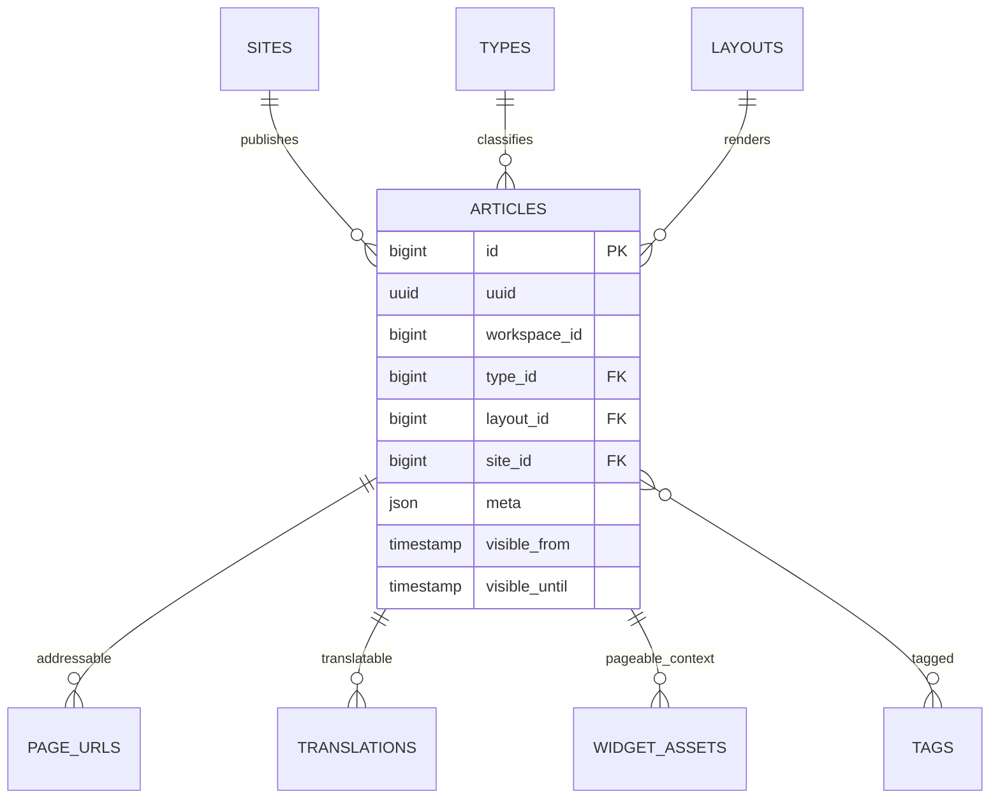

# Blog

Status: **Available, schema-owning** · Kind: **package** · Tier: **free** · Bundle: **foundation** · Contexts: **admin, frontend, console** · Product group: **Capell Foundation**

This page is the consolidated implementation overview for the Blog package. It is extracted from the package README, service providers, migrations, config files, routes, resources, models, actions, and the shared Capell ERD notes where available.

## What This Plugin Adds

Blog adds article publishing, archive pages, tag pages, article widgets, Site Discovery sitemap contributions, and frontend Livewire page components to Capell.

- Article Filament resource.
- Blog, archive, and tag frontend Livewire components.
- Article widgets and configurators for layout builder.
- Site Discovery sitemap contributions for articles, archives, and tags.
- Commands to install and create blog pages.

## Developer Notes

Builds on core pages, layouts, translations, page URLs, core layout builder widgets, and tags while keeping article-specific logic in actions and loaders.

- BlogServiceProvider, AdminServiceProvider, ConsoleServiceProvider, and FrontendServiceProvider register package surfaces.
- Migration creates articles.
- Model: Article.
- Filament resource: ArticleResource.
- Livewire pages: Blog, Archive, Tag.
- Listeners sync navigation and translation changes.

## Operational Notes

Gives editors a dedicated article workflow that still fits the same structured publishing foundation as pages.

- Adds articles table and article admin resource.
- Adds blog frontend components and Site Discovery sitemap contributions.
- Adds console commands for setup, install, demo, faker, and page creation.
- May add blog pages to navigation through listener behaviour.

## Data And Retention

- articles stores uuid, workspace, type, layout, site, meta, visible_from, and visible_until.
- Articles connect to sites, types, layouts, page URLs, translations, core layout builder widget assets, and tags.
- Blog uses the layout builder APIs provided by the admin/frontend core packages.
- Deletion and retention behaviour should be verified against the host application policy.

## Screenshot Plan

- Articles admin index.
- Create/edit article form.
- Blog page frontend output.
- Archive page frontend output.
- Tag page frontend output.

## Pitfalls

- Run the package setup before expecting archive/tag pages.
- Check layouts before creating article records.
- Cache and Site Discovery sitemap output may need regeneration after setup.

## Verification

- Run `vendor/bin/pest packages/blog/tests` when package tests exist.
- Run the relevant host-app migration or package install flow in a disposable database.
- Open the listed admin or frontend surface and compare it with the screenshot plan.

## Package Manifest

- Composer name: `capell-app/blog`
- Product group: Capell Foundation
- Kind: package
- Tier: free
- Bundle: foundation
- Contexts: `admin`, `frontend`, `console`
- Optional dependencies: None listed.

## Admin Surfaces

- ArticleResource (packages/blog/src/Filament/Resources/Articles/ArticleResource.php, slug `article`)
- CreateArticle (packages/blog/src/Filament/Resources/Articles/Pages/CreateArticle.php)
- EditArticle (packages/blog/src/Filament/Resources/Articles/Pages/EditArticle.php)
- ListArticles (packages/blog/src/Filament/Resources/Articles/Pages/ListArticles.php)

## Commands

- `capell:blog-create-pages {site : The ID of the site to create blog pages for}` (packages/blog/src/Console/Commands/CreateBlogPagesCommand.php)
- `capell:blog-demo {--sites=} {--user=} {--limit=}` (packages/blog/src/Console/Commands/DemoCommand.php)
- `capell:blog-faker {--count=25} {--sites=} {--languages=} {--force}` (packages/blog/src/Console/Commands/FakerCommand.php)
- `capell:blog-install` (packages/blog/src/Console/Commands/InstallCommand.php)
- `capell:blog-setup {--user= : Ignored — accepted for compatibility with capell:install} {--sites= : Ignored — accepted for compatibility with capell:install} {--languages= : Ignored — accepted for compatibility with capell:install} {--url= : Ignored — accepted for compatibility with capell:install}` (packages/blog/src/Console/Commands/SetupCommand.php)

## Routes And Config

- None proven in this package directory.

## Permissions And Gates

- Gate: ArticleHealthWidgetAbstract: `developer`, `admin`, `super_admin`
- Gate: TopPagesWidgetAbstract: `admin`, `super_admin`
- Gate: TrafficChartWidgetAbstract: `admin`, `super_admin`

## Migrations

- Migration: 2026_05_10_190842_01_create_articles_table.php

## ERD Excerpt

## Screenshot Automation

Deployment should read [screenshots.json](screenshots.json), install the package with demo data, resolve each admin surface or frontend URL, and write images to `public/docs/screenshots/packages/blog`.

- Articles admin index.
- Create/edit article form.
- Blog page frontend output.
- Archive page frontend output.
- Tag page frontend output.
