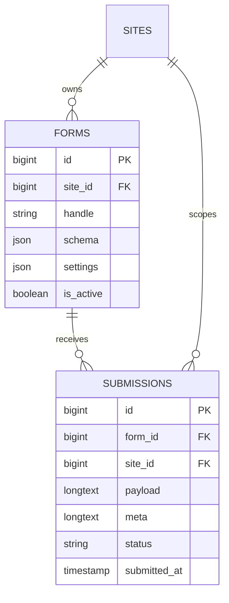

# FormBuilder

Status: **Available, schema-owning** · Kind: **package** · Tier: **premium** · Bundle: **form-builder** · Contexts: **admin, frontend** · Product group: **Capell FormBuilder**

This page is the consolidated implementation overview for the FormBuilder package. It is extracted from the package README, service providers, migrations, config files, routes, resources, models, actions, and the shared Capell ERD notes where available.

## What This Plugin Adds

FormBuilder adds form definitions, encrypted submissions, frontend Livewire rendering, validation, and submission status handling to Capell.

- Form and submission models.
- Frontend Livewire form component.
- Actions for validation, submission creation, archiving, read state, and spam marking.
- FormSubmitted event.
- Configurable submission storage and request metadata collection.

## Developer Notes

Keeps form schema, settings, submission payload, and metadata in data objects and casts so form handling remains typed across layers.

- FormBuilderServiceProvider registers the package.
- Config file: capell-form-builder.php.
- Migrations create form-builder and submissions.
- Models: Form and Submission.
- Livewire component: FormComponent.
- EncryptedDataCast protects stored submission data.

## Operational Notes

Lets editors collect responses from structured websites while keeping submission review inside the Capell admin workflow.

- Adds form-builder and submissions tables.
- Adds frontend Livewire form component.
- Adds config keys for storing submissions, IP address collection, and user agent collection.
- No routes are visible in this package.

## Data And Retention

- form-builder belongs to sites and stores handle, schema, settings, and active state.
- submissions belongs to form-builder and sites and stores payload, meta, status, and submitted_at.
- Submission payload and metadata are represented by data objects.
- Deletion and retention rules should be verified against the host application policy.

## Screenshot Plan

- FormBuilder admin index.
- Create/edit form schema screen.
- Submissions index.
- Frontend form output.
- Submission detail view.

## Pitfalls

- Disable IP/user agent collection where privacy policy requires it.
- Run migrations before rendering form components.
- Validate field schema before accepting public submissions.

## Verification

- Run `vendor/bin/pest packages/form-builder/tests` when package tests exist.
- Run the relevant host-app migration or package install flow in a disposable database.
- Open the listed admin or frontend surface and compare it with the screenshot plan.

## Package Manifest

- Composer name: `capell-app/form-builder`
- Product group: Capell FormBuilder
- Kind: package
- Tier: premium
- Bundle: form-builder
- Contexts: `admin`, `frontend`
- Requires: `capell-app/core`, `capell-app/admin`, `capell-app/frontend`
- Optional dependencies: None listed.

## Admin Surfaces

- None proven in this package directory.

## Commands

- None proven in this package directory.

## Routes And Config

- Config: packages/form-builder/config/capell-form-builder.php

## Permissions And Gates

- None proven in this package directory.

## Migrations

- Migration: create_form-builder_table.php
- Migration: create_submissions_table.php

## ERD Excerpt

## Screenshot Automation

Deployment should read [screenshots.json](screenshots.json), install the package with demo data, resolve each admin surface or frontend URL, and write images to `public/docs/screenshots/packages/form-builder`.

- FormBuilder admin index.
- Create/edit form schema screen.
- Submissions index.
- Frontend form output.
- Submission detail view.
