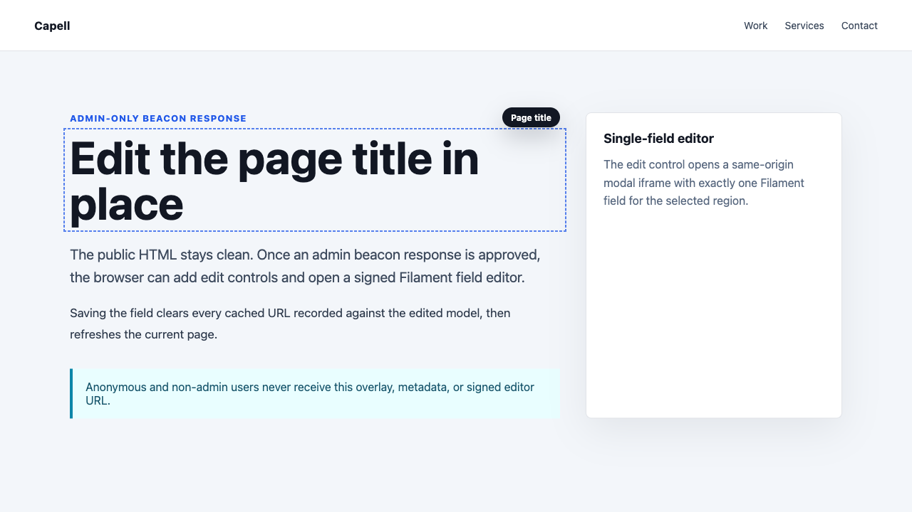

# In-page Editing

Frontend Authoring lets an admin edit page fields from the rendered frontend without putting editor metadata into public HTML. The page renders normally, the beacon runs after load, and only an authenticated admin beacon response can add edit controls.



## Admin Flow

1. The public page is rendered by the active frontend theme and can be served from HTML cache.
2. The frontend beacon client posts the current URL to `capell-frontend.beacon`.
3. The beacon resolves the URL to `PageUrl`, checks the authenticated user, and stops unless the user is an admin.
4. For admins only, the beacon returns a small authoring bootstrap script with a selector-based editable region manifest.
5. The browser decorates the page title, page description target, and content target with edit controls.
6. Selecting a control opens a signed modal iframe.
7. The iframe renders one Filament field, saves through `UpdateEditableRegionAction`, clears all recorded HTML caches for the edited model, and refreshes the current page.

## Non-admin Safety

Anonymous and non-admin users must be completely unaware that authoring exists. They receive no editor HTML, editor JavaScript, editable attributes, labels, selectors, model IDs, field paths, package hints, permissions, or signed URLs.

Do not add authoring markers to Blade, theme components, public JavaScript, or cached HTML. If a frontend package needs editable regions, register them with the authoring registry so the admin-only beacon can return them after the page has loaded.

## Built-in Regions

| Region           | Model field                    | Field type    | Default selector                         |
| ---------------- | ------------------------------ | ------------- | ---------------------------------------- |
| Page title       | `Translation.title`            | Text input    | `#main h1:first-of-type`                 |
| Page description | `Translation.meta.description` | Textarea      | `#main h1:first-of-type`                 |
| Page content     | `Translation.content`          | HTML textarea | `#main .content-component:first-of-type` |

Package-owned regions should be registered through the `capell-frontend-authoring:editable-regions` tag. Use stable selectors that already exist for presentation; do not add hidden authoring-only markers to cached markup.

## HTML Cache Invalidation

Before saving, `UpdateEditableRegionAction` reads `CacheEnum::modelUrlCacheKey()` and collects every cached URL whose model map contains the edited model short name and record ID. After the Filament field save, `ClearAffectedCachedUrlsAction` removes each matching cached HTML file and queues warmups for affected URLs when auto-refresh is enabled.

The cache map shape is:

```php
[
    'https://example.com/about' => [
        'Translation' => [42],
        'Page' => [7],
    ],
]
```

That gives authoring enough information to refresh every cached URL that used the edited record, while the public cache still contains ordinary HTML.

## Screenshot Package Requirements

The screenshot/demo package must Composer require the full stack below before running browser screenshots. Requiring only `capell-app/frontend-authoring` can prove the service provider boots, but it does not prove that a frontend page, default beacon script, admin route, and editor iframe can work together.

```bash
composer require \
  capell-app/core \
  capell-app/admin \
  capell-app/frontend \
  capell-app/foundation-theme \
  capell-app/frontend-authoring
```

The committed screenshot manifest records the same stack in `composerRequires` so deployment can install the real frontend authoring surface before capturing screenshots.

## Browser Test Contract

The screenshot runner should execute browser checks against the installed demo site, not a Blade-only render:

| Scenario                          | Expected result                                                                                                                    |
| --------------------------------- | ---------------------------------------------------------------------------------------------------------------------------------- |
| Anonymous page load               | Page renders with no authoring DOM, no authoring styles, no authoring scripts, and no authoring console errors.                    |
| Non-admin authenticated page load | Beacon returns normal user data only; the DOM remains free of authoring UI and metadata.                                           |
| Admin page load                   | Beacon returns the authoring bootstrap script, the page title receives an edit control, and the control is visible on hover/focus. |
| Admin opens editor                | Clicking the page title control opens a same-origin signed iframe with exactly one Filament field.                                 |
| Admin saves editor                | The modal closes, the current page refreshes, and cached URLs recorded for the edited model are cleared or queued for warmup.      |

At minimum, capture desktop and mobile screenshots for the admin page-load state and keep one network/console proof that non-admin responses did not include authoring metadata.
