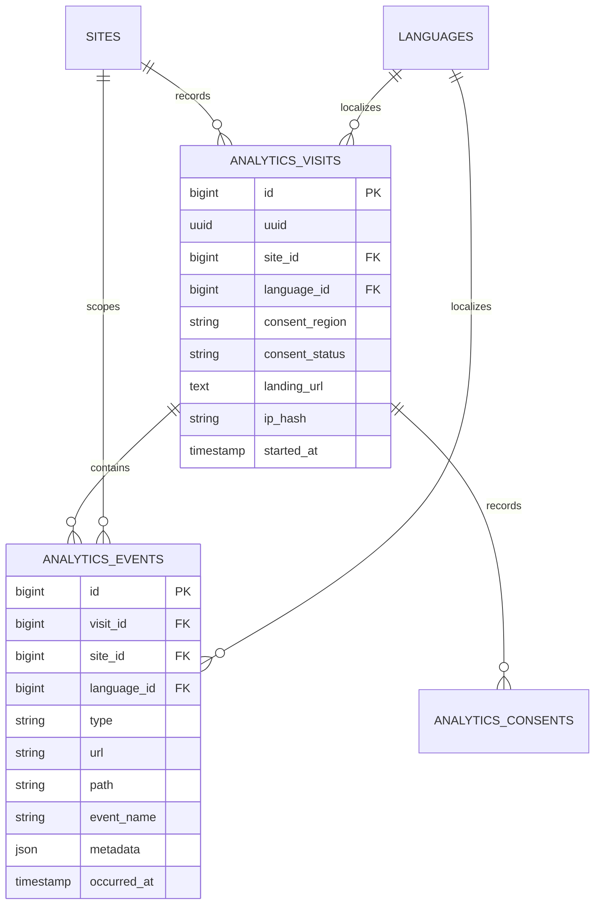

# Insights

Status: **Available, schema-owning** · Kind: **package** · Tier: **premium** · Bundle: **growth** · Contexts: **admin, frontend** · Product group: **Capell Growth**

This page is the consolidated implementation overview for the Insights package. It is extracted from the package README, service providers, migrations, config files, routes, resources, models, actions, and the shared Capell ERD notes where available.

## What This Plugin Adds

Insights records first-party visits, events, consent decisions, page views, clicks, and journey data for Capell sites.

- Frontend beacon endpoints for events and consent.
- Render hook that can register the tracker.
- Dashboard widgets for overview stats, popular pages, top actions, journeys, and trending pages.
- Settings schema for insights retention and behaviour.

## Developer Notes

Keeps insights in Laravel actions and data objects, with explicit consent enums and configurable routes.

- InsightsServiceProvider and AdminServiceProvider register routes, settings, and widgets.
- Config file: capell-insights.php.
- Routes: POST capell/insights/events and POST capell/insights/consent by default.
- Models: InsightsVisit, InsightsConsent, InsightsEvent.
- Actions record page views, clicks, custom events, and consent updates.
- PurgeInsightsDataCommand supports retention cleanup.

## Operational Notes

Gives site operators practical traffic and journey insight without sending the workflow through an external dashboard first.

- Adds insights tables and settings migration.
- Adds beacon and consent public POST routes.
- Adds dashboard widgets and insights settings.
- Uses capell-insights config keys for route prefix, consent, hashing, retention, and ignored paths.
- May need scheduled cleanup if retention should be enforced automatically.

## Data And Retention

- insights_visits stores site, language, consent, landing URL, hashed visitor data, and start time.
- insights_consents stores consent decisions for a visit.
- insights_events stores event type, URL, path, metadata, and occurrence time.
- Visits relate to events and consents.
- Retention is governed by retention_days and purge actions.

## Screenshot Plan

- Insights overview dashboard widgets.
- Popular pages widget.
- Recent journeys widget.
- Insights settings screen.
- Frontend page with tracker active.

## Pitfalls

- Exclude admin, Livewire, and insights routes from tracking.
- Set hash_salt deliberately before production data is recorded.
- Consent settings must match the site privacy policy.

## Verification

- Run `vendor/bin/pest packages/insights/tests` when package tests exist.
- Run the relevant host-app migration or package install flow in a disposable database.
- Open the listed admin or frontend surface and compare it with the screenshot plan.

## Package Manifest

- Composer name: `capell-app/insights`
- Product group: Capell Growth
- Kind: package
- Tier: premium
- Bundle: growth
- Contexts: `admin`, `frontend`
- Requires: `capell-app/core`, `capell-app/admin`, `capell-app/frontend`
- Optional dependencies: None listed.

## Admin Surfaces

- None proven in this package directory.

## Commands

- `insights:purge {--days= : Override insights retention days}` (packages/insights/src/Console/Commands/PurgeInsightsDataCommand.php)

## Routes And Config

- Config: packages/insights/config/capell-insights.php
- Route file: packages/insights/routes/web.php

## Permissions And Gates

- Gate: InsightsOverviewStatsWidget: `admin`, `super_admin`
- Gate: PopularPagesWidget: `admin`, `super_admin`
- Gate: RecentJourneysWidget: `admin`, `super_admin`
- Gate: TopActionsWidget: `admin`, `super_admin`
- Gate: TrendingPagesWidget: `admin`, `super_admin`

## Migrations

- Migration: 2026_04_20_000001_create_insights_visits_table.php
- Migration: 2026_04_20_000002_create_insights_consents_table.php
- Migration: 2026_04_20_000003_create_insights_events_table.php
- Settings migration: create_insights_settings.php

## ERD Excerpt

## Screenshot Automation

Deployment should read [screenshots.json](screenshots.json), install the package with demo data, resolve each admin surface or frontend URL, and write images to `public/docs/screenshots/packages/insights`.

- Insights overview dashboard widgets.
- Popular pages widget.
- Recent journeys widget.
- Insights settings screen.
- Frontend page with tracker active.
