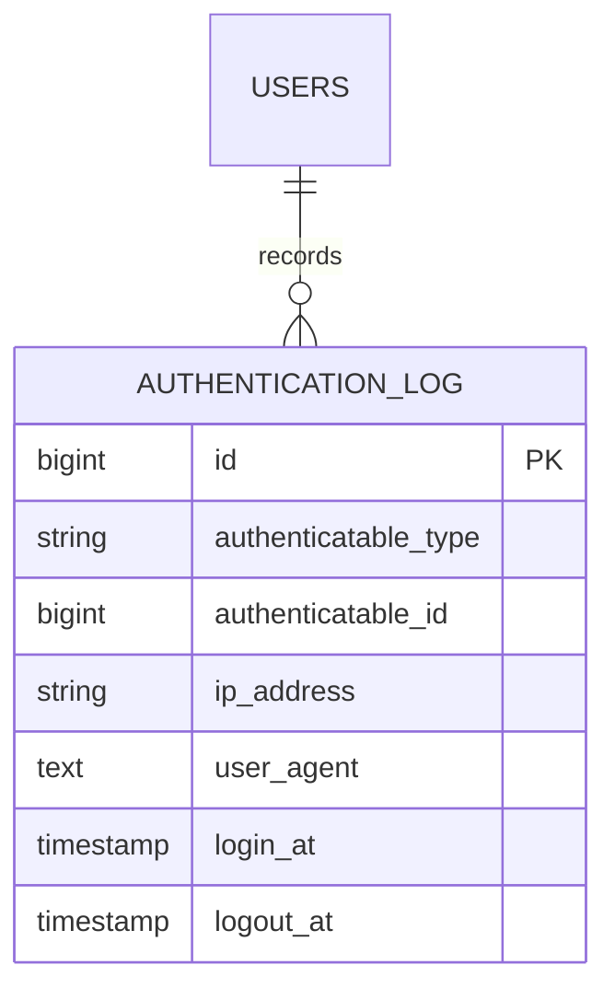

# Login Audit

Status: **Available, schema-owning** · Kind: **package** · Tier: **premium** · Bundle: **operations** · Contexts: **admin** · Product group: **Capell Operations**

This page is the consolidated implementation overview for the Login Audit package. It is extracted from the package README, service providers, migrations, config files, routes, resources, models, actions, and the shared Capell ERD notes where available.

## What This Plugin Adds

Login Audit records login, failed login, logout, and admin/user activity metadata for Capell users.

- Filament resource for authentication logs.
- Dashboard widget for recent authentication activity.
- Settings schema for authentication log behaviour.
- Middleware for admin and user activity tracking.

## Developer Notes

Wraps Rappasoft Laravel Login Audit with Capell settings, resources, widgets, query actions, and IP resolution policy.

- LoginAuditServiceProvider and AdminServiceProvider register the package.
- Config file: login-audit.php.
- Migration creates login_audit.
- Model: LoginAudit.
- Filament resource: LoginAuditResource.
- Middleware: AdminActivityMiddleware and UserActivityMiddleware.

## Operational Notes

Helps site operators review access activity and spot account behaviour that needs follow-up.

- Adds login_audit table.
- Adds settings migration.
- Adds authentication log admin resource and widget.
- Listens to Laravel auth events configured in login-audit.php.
- May send new-device or failed-login notifications depending on config.

## Data And Retention

- login_audit stores authenticatable type/id, IP address, user agent, login time, and logout time.
- Records belong polymorphically to authenticatable users.
- Config purge value defaults to 365 days.

## Screenshot Plan

- Authentication logs admin index.
- Authentication log table filters.
- Dashboard widget.
- Authentication log settings screen.

## Pitfalls

- Set CDN IP header config before trusting IP addresses behind a proxy.
- Confirm notification settings before production rollout.
- Run migrations before loading the resource.

## Verification

- Run `vendor/bin/pest packages/login-audit/tests` when package tests exist.
- Run the relevant host-app migration or package install flow in a disposable database.
- Open the listed admin or frontend surface and compare it with the screenshot plan.

## Package Manifest

- Composer name: `capell-app/login-audit`
- Product group: Capell Operations
- Kind: package
- Tier: premium
- Bundle: operations
- Contexts: `admin`
- Requires: `capell-app/admin`
- Optional dependencies: None listed.

## Admin Surfaces

- LoginAuditResource (packages/login-audit/src/Filament/Resources/LoginAudits/LoginAuditResource.php)

## Commands

- None proven in this package directory.

## Routes And Config

- Config: packages/login-audit/config/login-audit.php

## Permissions And Gates

- Gate: LoginAuditsWidget: `admin`, `super_admin`

## Migrations

- Migration: create_login_audit_table.php
- Settings migration: add_login_audit_settings.php

## ERD Excerpt

## Screenshot Automation

Deployment should read [screenshots.json](screenshots.json), install the package with demo data, resolve each admin surface or frontend URL, and write images to `public/docs/screenshots/packages/login-audit`.

- Authentication logs admin index.
- Authentication log table filters.
- Dashboard widget.
- Authentication log settings screen.
