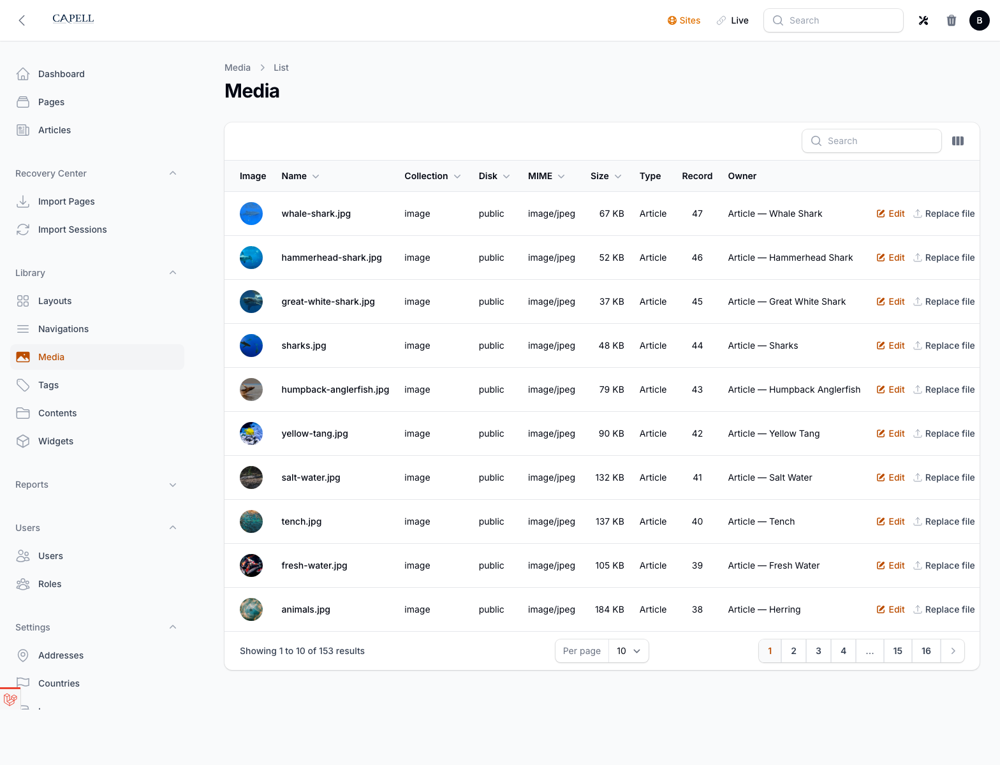

# Media AIOrchestrator

The Media AIOrchestrator package adds optional AI-backed image actions to Capell's existing media resource. It does not replace the media backend, crop system, or localized metadata model.

Status: `Optional` · Surface: `Admin` · Depends on: `capell-app/admin`, `capell-app/core`



## What It Adds

- A `Doctor image` action on image records in the Media resource.
- A small form for the editor to choose the image operation and add instructions.
- A `Capell\MediaAI\Contracts\ImageDoctor` contract that an ai-orchestrator package can bind to the real image-editing implementation.
- A safe default `NullImageDoctor`, so installing the package never exposes a broken action before an AI driver is configured.

## Editor Flow

1. Upload or open an image in Admin > Media.
2. Select `Doctor image`.
3. Choose the operation, such as background removal or cleanup.
4. Add short instructions.
5. Submit the action.

When an `ImageDoctor` implementation returns a replacement media record, the notification links the editor to the generated image. If the implementation only returns a warning, the original media record remains unchanged.

## Integration Contract

AIOrchestrator-backed packages should bind the contract in their service provider:

```php
use Capell\MediaAI\Contracts\ImageDoctor;

$this->app->bind(ImageDoctor::class, AIOrchestratorImageDoctor::class);
```

The implementation receives the current media record and an `ImageDoctorRequest`. It returns an `ImageDoctorResult` with a success message, optional replacement media, and optional warning.

## Boundaries

- Cropping remains owned by Curator when `capell.media.backend` is `curator`.
- Spatie installs use Capell's fallback focal-point and crop-preset UI.
- Localized alt text, captions, credits, and decorative flags are stored in the shared `translations.meta` JSON column.
