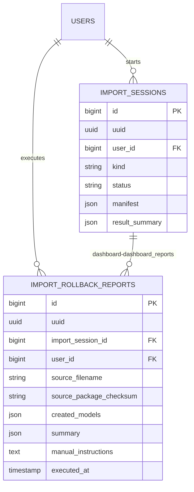

# MigrationAssistant

Status: **Available, schema-owning** · Kind: **package** · Tier: **premium** · Bundle: **operations** · Contexts: **admin, console** · Product group: **Capell Operations**

This page is the consolidated implementation overview for the MigrationAssistant package. It is extracted from the package README, service providers, migrations, config files, routes, resources, models, actions, and the shared Capell ERD notes where available.

## What This Package Adds

MigrationAssistant provides the Capell Migration AIOrchestrator: package export/import, CSV/XML source reads, source contracts for add-on importers, field mapping, preview, validation, dependency graph review, relation resolution, media ingest, queued execution, and rollback dashboard-dashboard_reports.

- Import source contracts expose rows, columns, metadata, and a suggested target.
- Native CSV and XML readers cover common flat-file migrations without extra Composer dependencies.
- Field mapping targets Capell pages and types. Collection-like imports resolve through the same target registry until another package registers a concrete collection target.
- Preview output separates creates, skips, warnings, and blocking errors before execution.
- Rollback dashboard-dashboard_reports capture created model class/id pairs, imported URL/media counts, source filename/checksum, executing user/time, and manual rollback instructions.
- Import session tracking, retry/cancel flow, notifications, and queued execution.
- Package reader/writer services.
- Import validation, relation resolution, dependency graph, and media ingest services.

## Developer Notes

Separates migration work into services, actions, DTOs, jobs, events, source readers, target registries, and resolver contracts so package and flat-file data can be moved with explicit ownership rules.

- MigrationAssistantServiceProvider registers the package.
- Config file: migration-assistant.php.
- Migrations create import_rollback_dashboard-dashboard_reports and import_sessions.
- Jobs execute import plans.
- Events report import completed or failed.
- Services cover package reading, writing, CSV/XML reading, mapping, preview, validation, relation resolution, media ingest, and rollback dashboard-dashboard_reports.
- WordPress WXR support lives in `capell-app/wordpress-importer`, which depends on this package and registers its reader through the source registry.

## Operational Notes

Supports controlled migration workflows where content, media, source files, and relationships need review before import and operators need evidence after execution.

- Adds import_rollback_dashboard-dashboard_reports and import_sessions tables.
- Adds migration-assistant queue configuration.
- Uses disk and path config for imports, exports, and working files.
- May require queue workers for long-running imports.
- No public routes are registered by this package.

## Data And Retention

- import_rollback_dashboard-dashboard_reports stores import session, created model ids, source filename/checksum, summary counts, executing user/time, and manual rollback instructions.
- import_sessions stores import kind, status, manifest, and result summary.
- Retention and deletion rules should be verified against the host application policy.

## Screenshot Plan

- Import session index or host admin surface.
- Import validation summary.
- Relation resolution review.
- Rollback report view.
- Package export intent screen.

## Pitfalls

- Configure MIGRATOR_QUEUE and MIGRATOR_DISK before large imports.
- Check upload and package size limits before importing client archives.
- Run queue workers before testing async import jobs.
- Review relation resolution before applying imported data.

## Verification

- Run `vendor/bin/pest packages/migration-assistant/tests` when package tests exist.
- Run the relevant host-app migration or package install flow in a disposable database.
- Open the listed admin or frontend surface and compare it with the screenshot plan.

## Package Manifest

- Composer name: `capell-app/migration-assistant`
- Product group: Capell Operations
- Kind: package
- Tier: premium
- Bundle: operations
- Contexts: `admin`, `console`
- Requires: `capell-app/core`
- Optional dependencies: None listed.

## Admin Surfaces

- None proven in this package directory.

## Commands

- None proven in this package directory.

## Routes And Config

- Config: packages/migration-assistant/config/migration-assistant.php

## Permissions And Gates

- Policy: OwnershipMap (packages/migration-assistant/src/Policy/OwnershipMap.php)

## Migrations

- Migration: create_import_rollback_dashboard-dashboard_reports_table.php
- Migration: create_import_sessions_table.php

## ERD Excerpt

## Screenshot Automation

Deployment should read [screenshots.json](screenshots.json), install the package with demo data, resolve each admin surface or frontend URL, and write images to `public/docs/screenshots/packages/migration-assistant`.

- Import session index or host admin surface.
- Import validation summary.
- Relation resolution review.
- Rollback report view.
- Package export intent screen.
