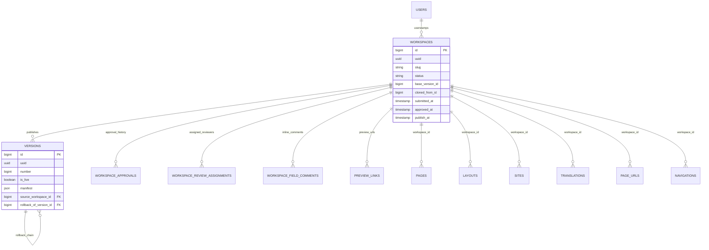

# PublishingStudio

Status: **Available, schema-owning** · Kind: **package** · Tier: **premium** · Bundle: **publishing-pro** · Contexts: **admin, console** · Product group: **Capell Publishing Pro**

This page is the consolidated implementation overview for the PublishingStudio package. It is extracted from the package README, service providers, migrations, config files, routes, resources, models, actions, and the shared Capell ERD notes where available.

## What This Plugin Adds

PublishingStudio is Capell's premium editorial timeline package. It brings the publishing loop into one workflow: preview, compare, approve, schedule, publish, and rollback content changes while preserving a readable history of what happened and why.

- Draft publishing-studio for safe copy-on-write editing.
- Signed live preview links with expiry, revocation, access counts, and a frontend preview banner.
- Compare, diff, dry-run validation, field comments, review assignments, publish readiness checks, URL-collision checks, and stale workspace warnings.
- Release Workspaces for grouped editorial releases that move coordinated content and package-owned draftable changes live atomically.
- Approval history for submit, approve, reject, and request-changes decisions.
- Scheduled publishing with release windows, unpublish dates, embargo windows, review reminders, immediate publishing, version history, rollback, and entity restore.
- Activity timeline, stale drafts, recovery import screens, load-test fixtures, and prune commands for editorial and operational audit trails.

## Developer Notes

Adds copy-on-write, draftable model support, workspace events, review policies, preview signing, and page resource extenders without moving domain logic into Filament pages.

- PublishingStudioServiceProvider, AdminServiceProvider, ConsoleServiceProvider register package surfaces.
- Routes include capell/preview/exit.
- Migrations create publishing-studio, versions, preview links, approvals, field comments, review assignments, and workspace columns on core/external tables.
- Events track state changes and version rollback.
- Publish checks include accessibility, broken links, missing alt text, SEO meta, stale workspace state, URL collisions, and release-window rules.

## Operational Notes

Gives editorial teams a Statamic-style content history feel while remaining a separate premium Capell package. Editors can move from draft to preview, review, schedule, publish, and restore without losing the context behind each decision.

- Adds workspace and versioning tables.
- Adds workspace_id columns to core and external tables.
- Adds admin resources/pages/widgets and frontend preview route.
- Adds middleware to resolve workspace context.
- Adds commands for install, load testing, and pruning abandoned publishing-studio.
- Adds recovery-center import screens for validation, relation resolution, execution, and rollback reporting when import workflows are enabled.

## Data And Retention

- publishing-studio stores uuid, slug, status, base version, cloned-from workspace, submitted/approved/publish timestamps, and kind/status metadata.
- versions stores uuid, number, live flag, manifest, source workspace, and rollback link.
- preview_links, workspace_approvals, workspace_review_assignments, and workspace_field_comments support preview, compare, comments, reviewer assignment, approval, and activity history.
- Core tables receive workspace_id columns.

## Screenshot Plan

- Editorial timeline dashboard.
- Live preview, preview link management, and preview banner.
- Compare, dry-run validation, and publish readiness panel.
- Approval history, reviewer assignments, and field comments.
- Scheduled publishing queue with embargo, unpublish, and review-reminder metadata.
- Stale drafts, recovery imports, activity history, and audit trail.
- Rollback, entity restore, and version history flow.

## Pitfalls

- Models participating in draft/publish must implement Draftable and be registered.
- Run migrations in order before using copy-on-write.
- Publish checks, stale workspace analysis, URL collisions, and release windows can block publishing.
- Preview links need expiry, revocation, and access-count review.
- Schedule release windows, unpublish dates, embargo rules, and review reminders must match site operations.
- Import recovery screens depend on the MigrationAssistant-backed import session tables when page import workflows are enabled.

## Verification

- Run `vendor/bin/pest packages/publishing-studio/tests` when package tests exist.
- Run the relevant host-app migration or package install flow in a disposable database.
- Open the listed admin or frontend surface and compare it with the screenshot plan.

## Related Docs

- [Release Workspaces](release-workspaces.md)

## Package Manifest

- Composer name: `capell-app/publishing-studio`
- Product group: Capell Publishing Pro
- Kind: package
- Tier: premium
- Bundle: publishing-pro
- Contexts: `admin`, `console`
- Marketplace headline: Editorial timeline workflow for preview, compare, approval, scheduling, publishing, and rollback.
- Requires: `capell-app/core`, `capell-app/admin`
- Optional dependencies: None listed.

## Admin Surfaces

- ActivityTrailPage (packages/publishing-studio/src/Filament/Pages/ActivityTrailPage.php, slug `dashboard-dashboard_reports/activity-trail`)
- ImportPagesPage (packages/publishing-studio/src/Filament/Pages/ImportPagesPage.php, slug `recovery-center/import-pages`)
- ScheduledPublishingPage (packages/publishing-studio/src/Filament/Pages/ScheduledPublishingPage.php, slug `scheduled-publishing`)
- StaleDraftsPage (packages/publishing-studio/src/Filament/Pages/StaleDraftsPage.php, slug `stale-drafts`)
- PageVersionHistoryPage (packages/publishing-studio/src/Filament/Resources/Pages/Pages/PageVersionHistoryPage.php, slug `{record}/history`)
- ManagePreviewLinks (packages/publishing-studio/src/Filament/Resources/PreviewLinks/Pages/ManagePreviewLinks.php)
- PreviewLinkResource (packages/publishing-studio/src/Filament/Resources/PreviewLinks/PreviewLinkResource.php)
- CompareVersionPage (packages/publishing-studio/src/Filament/Resources/PublishingStudio/Pages/CompareVersionPage.php, slug `{record}/compare`)
- ManagePublishingStudio (packages/publishing-studio/src/Filament/Resources/PublishingStudio/Pages/ManagePublishingStudio.php)
- WorkspaceResource (packages/publishing-studio/src/Filament/Resources/PublishingStudio/WorkspaceResource.php)

## Commands

- `capell:publishing-studio-install` (packages/publishing-studio/src/Console/Commands/InstallCommand.php)
- `capell:publishing-studio:load-test {--publishing-studio=10 : Number of publishing-studio to create} {--rows-per-workspace=100 : Fixture rows per workspace} {--fresh : Truncate the fixture workspace tables first} {--publish= : Publish the first N publishing-studio after populating (defaults to 0)} {--force : Allow running outside local/testing environments}` (packages/publishing-studio/src/Console/Commands/LoadTestPublishingStudioCommand.php)
- `capell:publishing-studio:prune {--id=* : Prune a specific workspace id instead of every abandoned workspace} {--dry-run : Report what would be pruned without making changes}` (packages/publishing-studio/src/Console/Commands/PruneAbandonedPublishingStudioCommand.php)

## Routes And Config

- Route file: packages/publishing-studio/routes/web.php

## Permissions And Gates

- Policy: WorkspacePolicy (packages/publishing-studio/src/Policies/WorkspacePolicy.php)
- Gate: ContentSchedulerOverviewWidget: `admin`, `super_admin`
- Gate: ImportPagesPage: Filament Shield page permissions
- Gate: ScheduledPublishingPage: Filament Shield page permissions
- Gate: StaleDraftsPage: Filament Shield page permissions
- Gate: WorkspaceActivityWidgetAbstract: `admin`, `super_admin`
- Gate: WorkspaceMergeHistoryWidgetAbstract: `super_admin`

## Migrations

- Migration: 2026_04_20_000001_create_publishing-studio_table.php
- Migration: 2026_04_20_000002_create_versions_table.php
- Migration: create_preview_links_table.php
- Migration: create_workspace_approvals_table.php
- Migration: create_workspace_field_comments_table.php
- Migration: create_workspace_review_assignments_table.php
- Migration: seed_bootstrap_workspace_version.php
- Migration: z_add_workspace_columns_to_core_tables.php
- Migration: z_add_workspace_id_to_external_tables.php
- Migration: z_add_workspace_id_to_import_sessions_table.php

## ERD Excerpt

## Screenshot Automation

Deployment should read [screenshots.json](screenshots.json), install the package with demo data, resolve each admin surface or frontend URL, and write images to `public/docs/screenshots/packages/publishing-studio`.

- Editorial timeline dashboard.
- Live preview, preview link management, and preview banner.
- Compare, dry-run validation, and publish readiness panel.
- Approval history, reviewer assignments, and field comments.
- Scheduled publishing queue with embargo, unpublish, and review-reminder metadata.
- Stale drafts, recovery imports, activity history, and audit trail.
- Rollback, entity restore, and version history flow.
