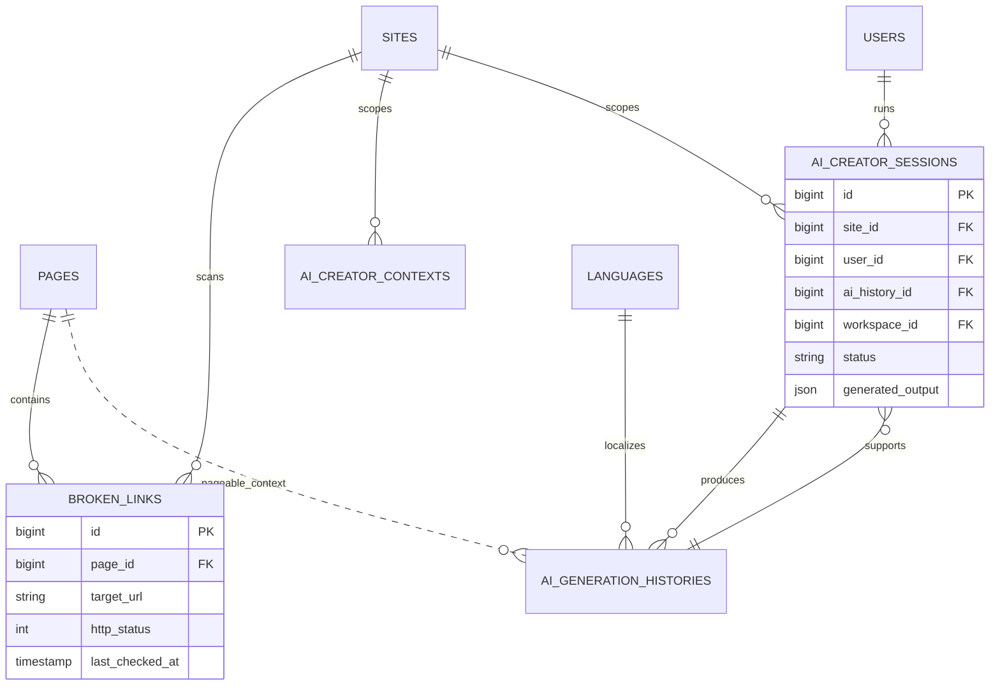

# SEO Suite

Status: **Available, schema-owning** · Kind: **package** · Tier: **premium** · Bundle: **search-seo** · Contexts: **admin, frontend, console** · Product group: **Capell Search & SEO**

This page is the consolidated implementation overview for the SEO Suite package. It is extracted from the package README, service providers, migrations, config files, routes, resources, models, actions, and the shared Capell ERD notes where available.

## What This Plugin Adds

SEO Suite adds metadata panels, sitemap generation, structured data, broken link tracking, Search Console insights, AI-assisted content briefs, and publish checks.

- Page and site SEO schema extenders.
- SEO audit, broken links, not-found URLs, sitemap, and translation coverage pages.
- Sitemap Livewire page and tool component.
- AI creator actions for briefs, images, layouts, metadata suggestions, and draft application.
- Search Console sync and dashboard-dashboard_reports.

## Developer Notes

Exposes SEO work as actions, contracts, data objects, settings schemas, and extenders that connect to core pages, sites, translations, routes, and optional AI providers.

- SeoSuiteServiceProvider registers settings, pages, extenders, commands, routes, and views.
- Config files: capell-seo-suite.php and exchanger.php.
- Migrations create broken links, page SEO snapshots, Search Console metrics, AI creator contexts, AI histories, and AI sessions.
- Commands cover install, setup, sitemap, AI cache, AI usage, and OpenAI connection testing.
- Controller: LlmsTxtController.

## Operational Notes

Gives editors and site operators practical checks before publishing and operational dashboard-dashboard_reports after launch.

- Adds SEO and AI-related tables/settings.
- Extends page and site admin form-builder.
- Adds SEO admin pages and widgets.
- Adds sitemap and llms.txt frontend output.
- Adds config for AI provider/model, image model, Search Console, publish gates, and prompts.

## Data And Retention

- broken_links stores page, target URL, HTTP status, and last check time.
- page_seo_snapshots store page SEO report state.
- search_console_url_metrics store imported Search Console values.
- ai_creator_contexts, ai_generation_histories, and ai_creator_sessions store AI workflow state.
- SEO data connects to sites, pages, languages, users, and publishing-studio.

## Screenshot Plan

- Page SEO panel.
- SEO audit page.
- Broken links page.
- Sitemap page.
- Translation coverage page.
- AI creator action modal.
- Search Console insights panel.

## Pitfalls

- Do not enable AI creator without checking provider credentials and review workflow.
- Search Console requires credentials and property URL.
- Publish gates can block publishing when required metadata is missing.
- Regenerate sitemap output after route or content changes.

## Verification

- Run `vendor/bin/pest packages/seo-suite/tests` when package tests exist.
- Run the relevant host-app migration or package install flow in a disposable database.
- Open the listed admin or frontend surface and compare it with the screenshot plan.

## Package Manifest

- Composer name: `capell-app/seo-suite`
- Product group: Capell Search & SEO
- Kind: package
- Tier: premium
- Bundle: search-seo
- Contexts: `admin`, `frontend`, `console`
- Requires: `capell-app/admin`, `capell-app/frontend`
- Optional dependencies: None listed.

## Admin Surfaces

- BrokenLinksPage (packages/seo-suite/src/Filament/Pages/BrokenLinksPage.php, slug `broken-links`)
- NotFoundUrlsPage (packages/seo-suite/src/Filament/Pages/NotFoundUrlsPage.php, slug `missing-pages`)
- SeoAuditPage (packages/seo-suite/src/Filament/Pages/SeoAuditPage.php, slug `seo-audit`)
- SitemapPage (packages/seo-suite/src/Filament/Pages/SitemapPage.php, slug `sitemap`)
- TranslationCoveragePage (packages/seo-suite/src/Filament/Pages/TranslationCoveragePage.php, slug `translation-coverage`)

## Commands

- `capell:admin-clear-ai-cache` (packages/seo-suite/src/Console/Commands/ClearAiCacheCommand.php)
- `capell:seo-suite-install` (packages/seo-suite/src/Console/Commands/InstallCommand.php)
- `capell:admin-monitor-ai-usage` (packages/seo-suite/src/Console/Commands/MonitorAiUsageCommand.php)
- `capell:seo-suite-setup` (packages/seo-suite/src/Console/Commands/SetupCommand.php)
- `capell:admin-test-openai` (packages/seo-suite/src/Console/Commands/TestOpenAiConnectionCommand.php)
- `capell:xml-sitemap {--site= : Only regenerate sitemaps for this site ID} {--incremental : Skip domains whose pages have not changed since the last run}` (packages/seo-suite/src/Console/Commands/XmlSitemapCommand.php)

## Routes And Config

- Config: packages/seo-suite/config/capell-seo-suite.php
- Config: packages/seo-suite/config/exchanger.php

## Permissions And Gates

- Policy: AiCreatorPolicy (packages/seo-suite/src/Policies/AiCreatorPolicy.php)
- Gate: AiMetricsWidgetAbstract: `developer`, `admin`, `super_admin`
- Gate: BrokenLinksPage: Filament Shield page permissions
- Gate: NotFoundUrlsPage: Filament Shield page permissions
- Gate: SeoAuditPage: Filament Shield page permissions
- Gate: SitemapPage: Filament Shield page permissions
- Gate: TranslationCoveragePage: Filament Shield page permissions

## Migrations

- Migration: 2026_04_18_000002_create_ai_creator_contexts_table.php
- Migration: 2026_04_18_000003_create_ai_generation_histories_table.php
- Migration: 2026_04_18_000004_create_ai_creator_sessions_table.php
- Migration: create_broken_links_table.php
- Migration: create_page_seo_snapshots_table.php
- Migration: create_search_console_url_metrics_table.php
- Settings migration: 2026_04_18_000001_update_ai-orchestrator_settings_add_ai_creator.php
- Settings migration: create_ai-orchestrator_settings.php

## ERD Excerpt

## Screenshot Automation

Deployment should read [screenshots.json](screenshots.json), install the package with demo data, resolve each admin surface or frontend URL, and write images to `public/docs/screenshots/packages/seo-suite`.

- Page SEO panel.
- SEO audit page.
- Broken links page.
- Sitemap page.
- Translation coverage page.
- AI creator action modal.
- Search Console insights panel.
