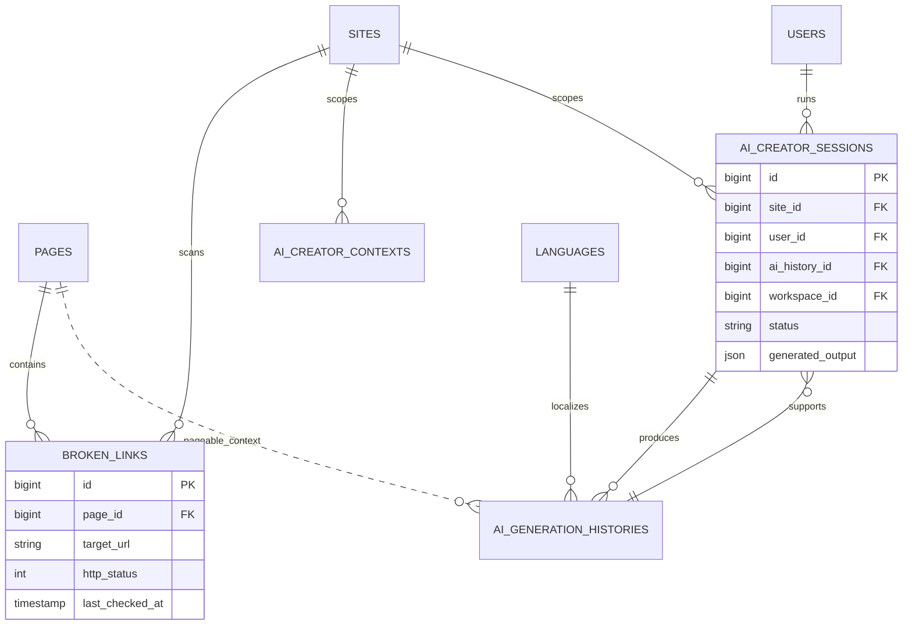

# SEO Suite

Status: **Available, schema-owning** · Kind: **package** · Tier: **premium** · Bundle: **search-seo** · Contexts: **admin, frontend, console** · Product group: **Capell Search & SEO**

This page is the consolidated implementation overview for the SEO Suite package. It is extracted from the package README, service providers, migrations, config files, routes, resources, models, actions, and the shared Capell ERD notes where available.

## What This Plugin Adds

SEO Suite adds metadata panels, sitemap generation, AI Discovery outputs, structured data, broken link tracking, Search Console insights, AI-assisted content briefs, and publish checks.

- Page and site SEO schema extenders, including the page editor SEO settings tab, report-backed edit audit widget, and Pages-list audit overview widget.
- SEO audit, AI Discovery, broken links, not-found URLs, sitemap, and translation coverage pages.
- Sitemap Livewire page and tool component.
- AI creator actions for briefs, images, layouts, metadata suggestions, and draft application.
- AI Discovery generation for `llms.txt`, optional `llms-full.txt`, per-page Markdown views, `robots.txt` AI crawler rules, and page-readiness audit signals.
- AI Discovery admin management for browsing pages, filling summaries, toggling page inclusion, previewing Markdown, and reviewing readiness issue counts.
- Search Console sync and dashboard-dashboard_reports.

## Developer Notes

Exposes SEO work as actions, contracts, data objects, settings schemas, and extenders that connect to core pages, sites, translations, routes, and optional AI providers.

- SeoSuiteServiceProvider registers settings, pages, extenders, commands, routes, and views.
- Config files: capell-seo-suite.php and exchanger.php.
- Migrations create broken links, page SEO snapshots, Search Console metrics, AI creator contexts, AI histories, AI sessions, AI Discovery site profiles, page profiles, crawler rules, and snapshots.
- Commands cover install, setup, sitemap, AI cache, AI usage, and OpenAI connection testing.
- Controllers: LlmsTxtController, LlmsFullTxtController, PageMarkdownController.

## AI Discovery

AI Discovery is an optional SEO Suite surface for AI-readable public content. It uses Capell's page, translation, URL, sitemap, robots, and SEO metadata rather than reverse-converting anonymous frontend HTML.

- `llms.txt` is generated per active site and language from public sitemap-eligible pages.
- `llms-full.txt` is opt-in per site/language and is bounded by page count and byte limits.
- Page Markdown output is available at `index.md` and `{url}.md`; the controller can use the active frontend context or resolve the site/language from the request URL.
- `Accept: text/markdown` rendering is separate from `.md` routes and must be enabled with the site/language `accept_markdown_enabled` control.
- `robots.txt` includes configurable AI crawler rules. Site-specific rows override global rows with the same provider, user-agent, and path, including disabling a global default for one site.
- Site profiles control `llms.txt`, `llms-full.txt`, Markdown pages, default include behavior, cache TTL, default section, limits, intro Markdown, and enabled/disabled state.
- Page profiles control include/exclude, summary, section, priority, optional Markdown override, generated Markdown state, and exclusion reason.
- Page editor quick-fill fields live in the SEO settings tab under AI Discovery and sync into page profiles.
- Site/language quick-fill fields live in site translation SEO metadata under AI Discovery and sync into site profiles.
- Snapshot records track generated output hashes, byte sizes, cache keys, expiry, status, and page/site context.
- Cache invalidation marks snapshots stale and forgets cached documents on page save/delete events and AI Discovery profile changes.
- Crawler rules seed from `capell-seo-suite.ai_discovery.default_crawler_rules`, can be shaped by the `ai_discovery_crawler_policy` setting, and render robots snippets for OAI-SearchBot, GPTBot, ChatGPT-User, ClaudeBot, Claude-SearchBot, Claude-User, PerplexityBot, Google-Extended, and CCBot.
- Full implementation notes live in [AI Discovery](ai-discovery.md).

## Operational Notes

Gives editors and site operators practical checks before publishing and operational dashboard-dashboard_reports after launch.

- Adds SEO and AI-related tables/settings.
- Extends page and site admin form-builder; page-level SEO fields live in this package rather than the core admin sidebar settings.
- Adds SEO admin pages and widgets, including the Pages-list overview widget through `PageResourceWidgetExtender`.
- Adds sitemap, `llms.txt`, `llms-full.txt`, `robots.txt`, and page Markdown frontend output.
- Adds config for AI provider/model, image model, Search Console, publish gates, and prompts.

## Data And Retention

- broken_links stores page, target URL, HTTP status, and last check time.
- page_seo_snapshots store page SEO report state.
- search_console_url_metrics store imported Search Console values.
- ai_creator_contexts, ai_generation_histories, and ai_creator_sessions store AI workflow state.
- ai_discovery_site_profiles, ai_discovery_page_profiles, ai_discovery_crawler_rules, and ai_discovery_snapshots store AI Discovery configuration, robots controls, and generated document state.
- SEO data connects to sites, pages, languages, users, and publishing-studio.

## Content Graph

SEO Suite contributes content graph edges from page SEO snapshots and broken-link records back to their pages. SEO snapshots use weak `DescribesPage` edges, and broken links use weak `FoundOnPage` edges. These records show up in impact previews and diagnostics without blocking ordinary page deletes as strong dependencies.

## Screenshot Plan

- Page SEO settings tab, Page SEO panel, edit audit widget, and Pages-list overview widget.
- SEO audit page.
- Broken links page.
- Sitemap page.
- Translation coverage page.
- AI creator action modal.
- Search Console insights panel.

## Pitfalls

- Do not enable AI creator without checking provider credentials and review workflow.
- Search Console requires credentials and property URL.
- Publish gates can block publishing when required metadata is missing.
- Regenerate sitemap output after route or content changes.
- Keep AI Discovery page summaries specific. Thin summaries, duplicate entity names, no canonical URL, no schema, no server-rendered text, disabled Markdown views, and noindex pages are reported by the AI-readiness audit action.
- Review crawler defaults before publishing robots output; search crawlers and training crawlers are deliberately configurable separately.
- Use the SEO Suite settings crawler policy as the default posture, then use crawler rule rows when a site needs a provider-specific override.

## Verification

- Run `vendor/bin/pest packages/seo-suite/tests` when package tests exist.
- Run the relevant host-app migration or package install flow in a disposable database.
- Open the listed admin or frontend surface and compare it with the screenshot plan.

## Package Manifest

- Composer name: `capell-app/seo-suite`
- Product group: Capell Search & SEO
- Kind: package
- Tier: premium
- Bundle: search-seo
- Contexts: `admin`, `frontend`, `console`
- Requires: `capell-app/admin`, `capell-app/frontend`
- Optional dependencies: None listed.

## Admin Surfaces

- BrokenLinksPage (packages/seo-suite/src/Filament/Pages/BrokenLinksPage.php, slug `broken-links`)
- AiDiscoveryPage (packages/seo-suite/src/Filament/Pages/AiDiscoveryPage.php, slug `ai-discovery`)
- NotFoundUrlsPage (packages/seo-suite/src/Filament/Pages/NotFoundUrlsPage.php, slug `missing-pages`)
- SeoAuditPage (packages/seo-suite/src/Filament/Pages/SeoAuditPage.php, slug `seo-audit`)
- SitemapPage (packages/seo-suite/src/Filament/Pages/SitemapPage.php, slug `sitemap`)
- TranslationCoveragePage (packages/seo-suite/src/Filament/Pages/TranslationCoveragePage.php, slug `translation-coverage`)

## Commands

- `capell:admin-clear-ai-cache` (packages/seo-suite/src/Console/Commands/ClearAiCacheCommand.php)
- `capell:seo-suite-install` (packages/seo-suite/src/Console/Commands/InstallCommand.php)
- `capell:admin-monitor-ai-usage` (packages/seo-suite/src/Console/Commands/MonitorAiUsageCommand.php)
- `capell:seo-suite-setup` (packages/seo-suite/src/Console/Commands/SetupCommand.php)
- `capell:admin-test-openai` (packages/seo-suite/src/Console/Commands/TestOpenAiConnectionCommand.php)
- `capell:xml-sitemap {--site= : Only regenerate sitemaps for this site ID} {--incremental : Skip domains whose pages have not changed since the last run}` (packages/seo-suite/src/Console/Commands/XmlSitemapCommand.php)

## Routes And Config

- Config: packages/seo-suite/config/capell-seo-suite.php
- Config: packages/seo-suite/config/exchanger.php

## Permissions And Gates

- Policy: AiCreatorPolicy (packages/seo-suite/src/Policies/AiCreatorPolicy.php)
- Gate: AiMetricsWidgetAbstract: `developer`, `admin`, `super_admin`
- Gate: BrokenLinksPage: Filament Shield page permissions
- Gate: AiDiscoveryPage: Filament Shield page permissions
- Gate: NotFoundUrlsPage: Filament Shield page permissions
- Gate: SeoAuditPage: Filament Shield page permissions
- Gate: SitemapPage: Filament Shield page permissions
- Gate: TranslationCoveragePage: Filament Shield page permissions

## Migrations

- Migration: 2026_04_18_000002_create_ai_creator_contexts_table.php
- Migration: 2026_04_18_000003_create_ai_generation_histories_table.php
- Migration: 2026_04_18_000004_create_ai_creator_sessions_table.php
- Migration: create_ai_discovery_crawler_rules_table.php
- Migration: create_ai_discovery_page_profiles_table.php
- Migration: create_ai_discovery_site_profiles_table.php
- Migration: create_ai_discovery_snapshots_table.php
- Migration: create_broken_links_table.php
- Migration: create_page_seo_snapshots_table.php
- Migration: create_search_console_url_metrics_table.php
- Settings migration: 2026_04_18_000001_update_ai-orchestrator_settings_add_ai_creator.php
- Settings migration: create_ai-orchestrator_settings.php

## ERD Excerpt

## Screenshot Automation

Deployment should read [screenshots.json](screenshots.json), install the package with demo data, resolve each admin surface or frontend URL, and write images to `public/docs/screenshots/packages/seo-suite`.

- Page SEO panel.
- SEO audit page.
- Broken links page.
- Sitemap page.
- Translation coverage page.
- AI creator action modal.
- Search Console insights panel.
